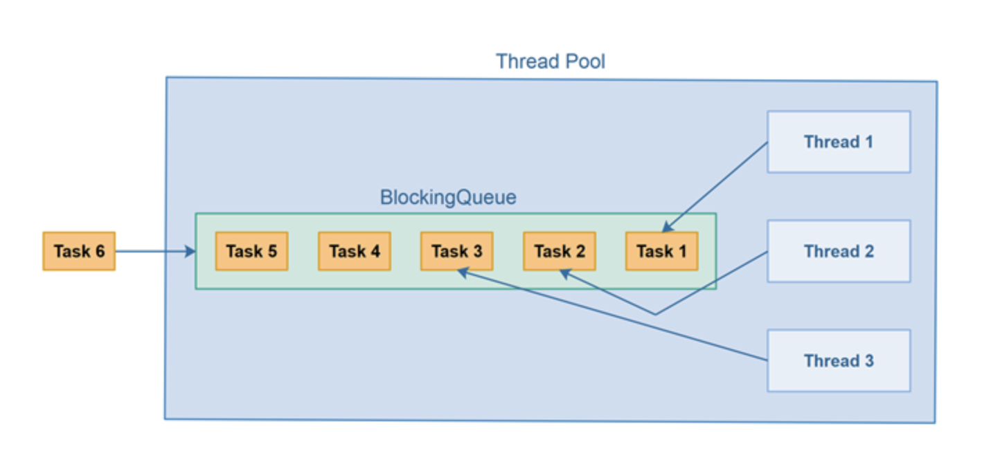

https://blog.caffinc.com/2016/03/simple-threadpool/


## Many thread + A queue to hold submitted tasks

Think of queue of submitted tasks, instead of low level threads.

Threads will be managed by thread pool. along with queues where tasks will be enqueued.
A thread pool is a pool threads that can be "reused" to execute tasks, so that each thread may execute more than one task



Thread pool implementation internally uses `LinkedBlockingQueue` for adding and removing tasks to the queue.

### Why use a LinkedNlockingQueue/concurrentLinkedQueue (Task queue)?

http://zhidko.net/threadpool.html

### Synchronization


### PoolThread

Abstraction on top of Thread that does the polling/dequeueing and execution.

```java
private class SimpleThreadpoolThread extends Thread {
    private AtomicBoolean execute;
    private ConcurrentLinkedQueue<Runnable> runnablesQueue;// runnable holds reference to the taskQueue, in order to poll/dequeue from it

    public SimpleThreadpoolThread(String name, AtomicBoolean execute, ConcurrentLinkedQueue<Runnable> runnablesQueue) {
        super(name);
        this.execute = execute;
        this.runnablesQueue = runnablesQueue;
    }

    @Override
    public void run() {
        try {
            // Continue to execute when the execute flag is true, or when there are runnables in the queue
            while (execute.get() || !runnablesQueue.isEmpty()) {
                Runnable runnable;
                // Poll a runnable from the queue and execute it
                while ((runnable = runnablesQueue.poll()) != null) {
                    runnable.run();
                }
                // Sleep in case there wasn't any runnable in the queue. This helps to avoid hogging the CPU.
                Thread.sleep(1);
            }
        } catch (RuntimeException | InterruptedException e) {
            throw new ThreadpoolException(e);
        }
    }
}
```

An alternative implementation which extends runnable instead of thread is following:
```java
// extending Runnable instead of Thread
public class PoolThreadRunnable implements Runnable {
    private Thread        thread    = null;
    private BlockingQueue taskQueue = null;// maintain reference to taskQueue in order to poll/dequeue from it
    private boolean       isStopped = false;

    public PoolThreadRunnable(BlockingQueue queue){
        taskQueue = queue;
    }

    public void run(){
        this.thread = Thread.currentThread();
        while(!isStopped()){
            try{
                Runnable runnable = (Runnable) taskQueue.take();
                runnable.run();
            } catch(Exception e){
                //log or otherwise report exception,
                //but keep pool thread alive.
            }
        }
    }

    public synchronized void doStop(){
        isStopped = true;
        //break pool thread out of dequeue() call.
        this.thread.interrupt();
    }

    public synchronized boolean isStopped(){
        return isStopped;
    }
}
```


## ThreadPool class

Mainly owns `taskQueue` + `Collection<Thread>`

```java
public class ThreadPool {

    private BlockingQueue taskQueue = null;
    private List<PoolThreadRunnable> threadList = new ArrayList<>();
    private boolean isStopped = false;

    public ThreadPool(int noOfThreads, int maxNoOfTasks){
        taskQueue = new ArrayBlockingQueue(maxNoOfTasks);

        for(int i=0; i<noOfThreads; i++){
            PoolThreadRunnable poolThreadRunnable =
                    new PoolThreadRunnable(taskQueue);

            threadList.add(new PoolThreadRunnable(taskQueue));
        }
        for(PoolThreadRunnable thread : threadList){ 
            new Thread(thread).start(); // start N threads that will keep polling taskQueue
        }
    }

    public synchronized void  execute(Runnable task) throws Exception{
        if(this.isStopped) throw
                new IllegalStateException("ThreadPool is stopped");

        this.taskQueue.offer(task);
    }

    public synchronized void stop(){
        this.isStopped = true;
        for(PoolThreadRunnable runnable : runnables){
            runnable.doStop();
        }
    }

    public synchronized void waitUntilAllTasksFinished() {
        while(this.taskQueue.size() > 0) {
            try {
                Thread.sleep(1);
            } catch (InterruptedException e) {
                e.printStackTrace();
            }
        }
    }
}
```