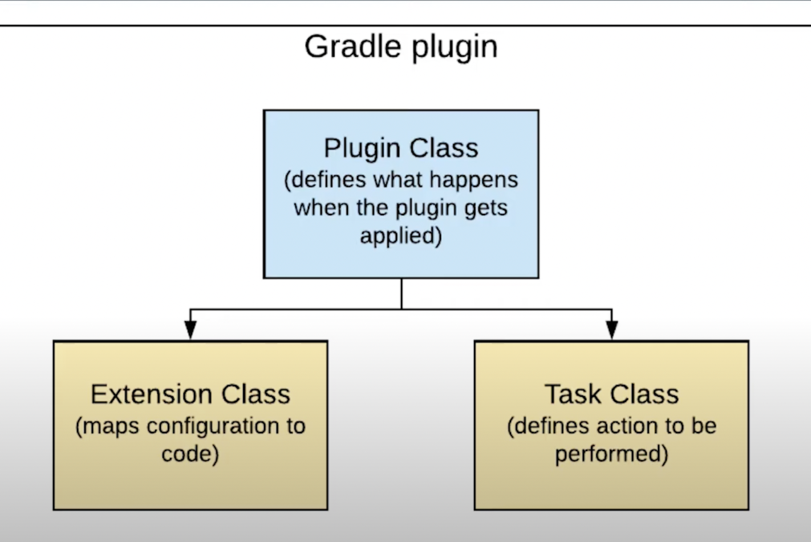

https://youtu.be/F3DF6bQo6jk?t=545

## Classes involved

Plugin class
Task class
Extension class



## Plugins to use: Use `java-gradle-plugin` for development assistance of gradle plugins

The Java Gradle Plugin development plugin can be used to assist in the development of Gradle plugins.

https://docs.gradle.org/current/userguide/java_gradle_plugin.html

```groovy
plugins {
    id 'groovy'
    id 'java-gradle-plugin'
}
```

## Dependencies

Using spock for testing = https://spockframework.org/spock/docs/2.1/introduction.html

