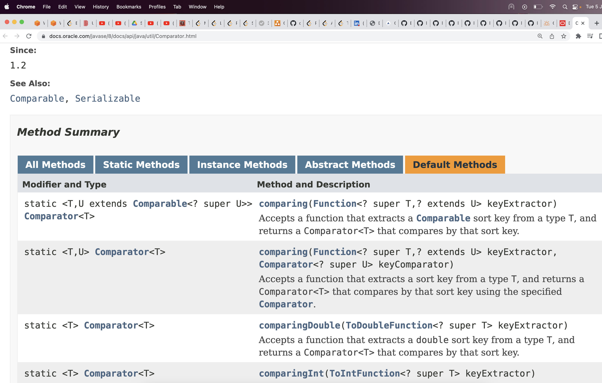

A collection of methods.

All methods are `public abstract` by default.

## Java 8 changes

### Adding static method to interfaces

**you can define static methods in interfaces**

If you add static methods, then programmers would regard them as utility methods, not as essential, core methods.

This makes it easier for you to organize helper methods in your libraries; you can keep static methods specific to an interface in the same interface rather than in a separate class.

## default implementation

When you extend an interface that contains a default method, you can do the following:

1. Not mention the default method at all, which lets your extended interface inherit the default method.
2. Redeclare the default method, which makes it abstract.
3. Redefine the default method, which overrides it.

Default methods enable you to add new functionality to existing interfaces and ensure binary compatibility with code written for older versions of those interfaces. 

**In particular, default methods enable you to add methods that accept lambda expressions as parameters to existing interfaces.**



### Calling default method in class via `super`

A class can override a default interface method and call the original method by using `super`
e.g.

```java
// interface defines a default method
interface A {
    default void foo() {
        System.out.println("A.foo");
    }
}

class B implements A {
    public void afoo() {
        // how to invoke A.foo() here?
        A.super.foo();
    }
}
```

Another example:

```java
interface One {
    default void method() {
        System.out.println("One");
    }
}

interface Two {
    default void method () {
        System.out.println("One");
    }
}

class Three implements One, Two {
    public void method() {
        One.super.method(); // invoke interface default method via `InterfaceName.super.defaultMethod()`
    }
}
```

## Functional interface / lambdas

A `Functional Interface` is an interface with `Single Abstract Method`.

A functional interface is any interface that contains only one abstract method. (A functional interface may contain one or more default methods or static methods.) Because a functional interface contains only one abstract method, you can omit the name of that method when you implement it. 

e.g.
```java
interface Predicate<T> {
    boolean test(T t);
}
```

## Why is `Interface Comparator<T>` a functional interface event though it has two abstract methods: `equals` and `compare`?

If an interface declares an abstract method overriding one of the public methods of `java.lang.Object` i.e. `equals`, that also does not count toward the interface's abstract method count since any implementation of the interface will have an implementation from `java.lang.Object` or elsewhere.

And since equals is one of those methods, the "abstract method count" of the interface is still `1`.

Wherever a `Comparator` can be passed, e.g. in sort methods, you can pass a lambda because it is a functional interface
e.g.
```java
Arrays.sort(people, (p1, p2) -> Integer.compare(p1[0], p2[0]));
```


