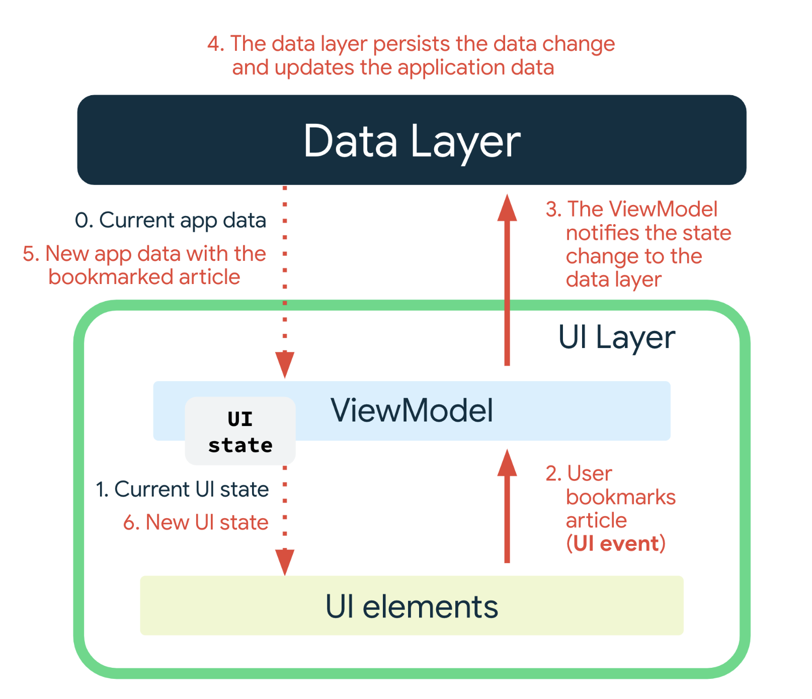

## UI layer

https://developer.android.com/topic/architecture/ui-layer
The UI layer that displays application data on the screen. Effectively, the UI is a visual representation of the application state as retrieved from the data layer.
The UI layer is the pipeline that converts application data changes to a form that the UI can present and then displays.

The UI layer is made up of two things:

1. UI elements that render the data on the screen. You build these elements using Views or Jetpack Compose functions.
2. State holders (such as `ViewModel` classes) that hold data, expose it to the UI, and handle logic.

### UiState

UiState - UI state is an immutable snapshot of the details needed for the UI to render.
```kt
data class LoginUiState(
    val isLoading: Boolean = false,
    val errorMessage: String? = null,
    val isUserLoggedIn: Boolean = false
)
```

or 
```kt
data class NewsUiState(
    val isSignedIn: Boolean = false,
    val isPremium: Boolean = false,
    val newsItems: List<NewsItemUiState> = listOf(),
    val userMessages: List<Message> = listOf()
)
```

### State holders

The classes that are `responsible for the production of UI state` and contain the necessary logic for that task are called state holders.

Use `ViewModel`: The `ViewModel` type is the recommended implementation for the management of screen-level UI state with access to the data layer.

## Uni-directional data flow



## Data Layer

The data layer of an app contains the business logic. The business logic is what gives value to your app—it's made of rules that determine how your app creates, stores, and changes data.

**The data layer is made of `repositories` that each can contain zero to many data sources.** 

You should create a repository class for each different type of data you handle in your app. For example, you might create a MoviesRepository class for data related to movies, or a PaymentsRepository class for data related to payments.

Repository classes are responsible for the following tasks:

* Exposing data to the rest of the app.
* Centralizing changes to the data.
* Resolving conflicts between multiple data sources.
* Abstracting sources of data from the rest of the app.
* Containing business logic.
