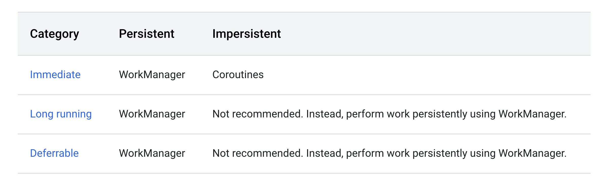

https://android.googlesource.com/platform/frameworks/base/+/master/services/core/java/com/android/server/am/OomAdjuster.md

## Definition

Code that executes when :
1. No activities shown
2. No foreground service running

## Types of background work

Background work falls into one of three primary categories:

* **Immediate**: Needs to execute right away and complete soon. You should use Kotlin coroutines (or java thread executors) for immediate impersistent work.
* **Long Running**: Work is long running if it is **likely to take more than 10 minutes to complete**
* **Deferrable**: Does not need to run right away.

Likewise, background work in each of these three categories can be either persistent or impersistent:

* **Persistent work**: Remains scheduled through app restarts and device reboots.
* **Impersistent work**: No longer scheduled after the process ends. 

## Approaches




## Getting process LRU list

```
adb shell dumpsys activity | grep 'Process LRU list' -A 50
```

## What happens if I start a thread from an activity and then leave the activity(back press) ?

Thread will stay alive only for sometime (till there is resource pressure in OS and the whole process along with the thread is cleared).

Try following and see logs:
```kt
class MainActivity : AppCompatActivity() {
    override fun onCreate(savedInstanceState: Bundle?) {
        super.onCreate(savedInstanceState)
        setContentView(R.layout.activity_main)

        thread(name = "piprinter") {
            for (i in 1..10000000000000) {
                println(i+1)
                Thread.sleep(100)
            }
        }
    }
}
```

How to check threads in process?
```shell
// 23991 is PID of our app/process which can be seen from logcat
adb shell ps -T | grep '23991'
```


## What happens to process/app when swiped away from recents?

All threads including main thread and activity/services are destroyed.


## What log do we get when process dies?
```
I/Zygote: Process 31323 exited due to signal (9)
I/ActivityManager: Process com.example.backgroundwork (pid 31323) has died: cch+6CRE // meaning in section below
```

The corresponding function in AMS is:
```java
  @GuardedBy("this")
    final void appDiedLocked(ProcessRecord app, int pid, IApplicationThread thread,
            boolean fromBinderDied, String reason) {
        // First check if this ProcessRecord is actually active for the pid.
        final ProcessRecord curProc;
        synchronized (mPidsSelfLocked) {
            curProc = mPidsSelfLocked.get(pid);
        }
        if (curProc != app) {
            if (!fromBinderDied || !mProcessList.handleDyingAppDeathLocked(app, pid)) {
                Slog.w(TAG, "Spurious death for " + app + ", curProc for " + pid + ": " + curProc);
            }
            return;
        }

        mBatteryStatsService.noteProcessDied(app.info.uid, pid);

        if (!app.isKilled()) {
            if (!fromBinderDied) {
                killProcessQuiet(pid);
                mProcessList.noteAppKill(app, ApplicationExitInfo.REASON_OTHER,
                        ApplicationExitInfo.SUBREASON_UNKNOWN, reason);
            }
            ProcessList.killProcessGroup(app.uid, pid);
            synchronized (mProcLock) {
                app.setKilled(true);
            }
        }

        // Clean up already done if the process has been re-started.
        IApplicationThread appThread;
        final int setAdj = app.mState.getSetAdj();
        final int setProcState = app.mState.getSetProcState();
        if (app.getPid() == pid && (appThread = app.getThread()) != null
                && appThread.asBinder() == thread.asBinder()) {
            boolean doLowMem = app.getActiveInstrumentation() == null;
            boolean doOomAdj = doLowMem;
            if (!app.isKilledByAm()) {
                reportUidInfoMessageLocked(TAG,
                        "Process " + app.processName + " (pid " + pid + ") has died: "
                        + ProcessList.makeOomAdjString(setAdj, true) + " "
                        + ProcessList.makeProcStateString(setProcState), app.info.uid);
                mAppProfiler.setAllowLowerMemLevelLocked(true);
            } else {
                // Note that we always want to do oom adj to update our state with the
                // new number of procs.
                mAppProfiler.setAllowLowerMemLevelLocked(false);
                doLowMem = false;
            }
            EventLogTags.writeAmProcDied(app.userId, pid, app.processName, setAdj, setProcState);
            if (DEBUG_CLEANUP) Slog.v(TAG_CLEANUP,
                "Dying app: " + app + ", pid: " + pid + ", thread: " + thread.asBinder());
            handleAppDiedLocked(app, pid, false, true, fromBinderDied);

            if (doOomAdj) {
                updateOomAdjLocked(OomAdjuster.OOM_ADJ_REASON_PROCESS_END);
            }
            if (doLowMem) {
                mAppProfiler.doLowMemReportIfNeededLocked(app);
            }
        } else if (app.getPid() != pid) {
            // A new process has already been started.
            reportUidInfoMessageLocked(TAG,
                    "Process " + app.processName + " (pid " + pid
                            + ") has died and restarted (pid " + app.getPid() + ").", app.info.uid);

            EventLogTags.writeAmProcDied(app.userId, app.getPid(), app.processName,
                    setAdj, setProcState);
        } else if (DEBUG_PROCESSES) {
            Slog.d(TAG_PROCESSES, "Received spurious death notification for thread "
                    + thread.asBinder());
        }

        // On the device which doesn't have Cgroup, log LmkStateChanged which is used as a signal
        // for pulling memory stats of other running processes when this process died.
        if (!hasMemcg()) {
            FrameworkStatsLog.write(FrameworkStatsLog.APP_DIED, SystemClock.elapsedRealtime());
        }
    }
```

### Process state to string in the log above:
```java
    /** @hide */
    public static String procStateToString(int procState) {
        final String procStateStr;
        switch (procState) {
            case ActivityManager.PROCESS_STATE_PERSISTENT:
                procStateStr = "PER ";
                break;
            case ActivityManager.PROCESS_STATE_PERSISTENT_UI:
                procStateStr = "PERU";
                break;
            case ActivityManager.PROCESS_STATE_TOP:
                procStateStr = "TOP ";
                break;
            case ActivityManager.PROCESS_STATE_BOUND_TOP:
                procStateStr = "BTOP";
                break;
            case ActivityManager.PROCESS_STATE_FOREGROUND_SERVICE:
                procStateStr = "FGS ";
                break;
            case ActivityManager.PROCESS_STATE_BOUND_FOREGROUND_SERVICE:
                procStateStr = "BFGS";
                break;
            case ActivityManager.PROCESS_STATE_IMPORTANT_FOREGROUND:
                procStateStr = "IMPF";
                break;
            case ActivityManager.PROCESS_STATE_IMPORTANT_BACKGROUND:
                procStateStr = "IMPB";
                break;
            case ActivityManager.PROCESS_STATE_TRANSIENT_BACKGROUND:
                procStateStr = "TRNB";
                break;
            case ActivityManager.PROCESS_STATE_BACKUP:
                procStateStr = "BKUP";
                break;
            case ActivityManager.PROCESS_STATE_SERVICE:
                procStateStr = "SVC ";
                break;
            case ActivityManager.PROCESS_STATE_RECEIVER:
                procStateStr = "RCVR";
                break;
            case ActivityManager.PROCESS_STATE_TOP_SLEEPING:
                procStateStr = "TPSL";
                break;
            case ActivityManager.PROCESS_STATE_HEAVY_WEIGHT:
                procStateStr = "HVY ";
                break;
            case ActivityManager.PROCESS_STATE_HOME:
                procStateStr = "HOME";
                break;
            case ActivityManager.PROCESS_STATE_LAST_ACTIVITY:
                procStateStr = "LAST";
                break;
            case ActivityManager.PROCESS_STATE_CACHED_ACTIVITY:
                procStateStr = "CAC ";
                break;
            case ActivityManager.PROCESS_STATE_CACHED_ACTIVITY_CLIENT:
                procStateStr = "CACC";
                break;
            case ActivityManager.PROCESS_STATE_CACHED_RECENT:
                procStateStr = "CRE ";
                break;
            case ActivityManager.PROCESS_STATE_CACHED_EMPTY:
                procStateStr = "CEM ";
                break;
            case ActivityManager.PROCESS_STATE_NONEXISTENT:
                procStateStr = "NONE";
                break;
            default:
                procStateStr = "??";
                break;
        }
        return procStateStr;
    }

```

### Process exit logs for SVC

```
 I/ActivityManager: Process com.example.backgroundwork (pid 727) has died: cch+2SVC 
 W/ActivityManager: Scheduling restart of crashed service com.example.backgroundwork/.MyService in 1000ms
 I/ActivityManager: Start proc 2178:com.example.backgroundwork/u0a92 for service com.example.backgroundwork/.MyService
 W/ActivityManager: Stopping service due to app idle: u0a92 -54s393ms com.example.backgroundwork/.MyService
```


### Simple service stop logs

```
W/ActivityManager: Stopping service due to app idle: u0a92 -1m7s951ms com.example.backgroundwork/.MyService
```