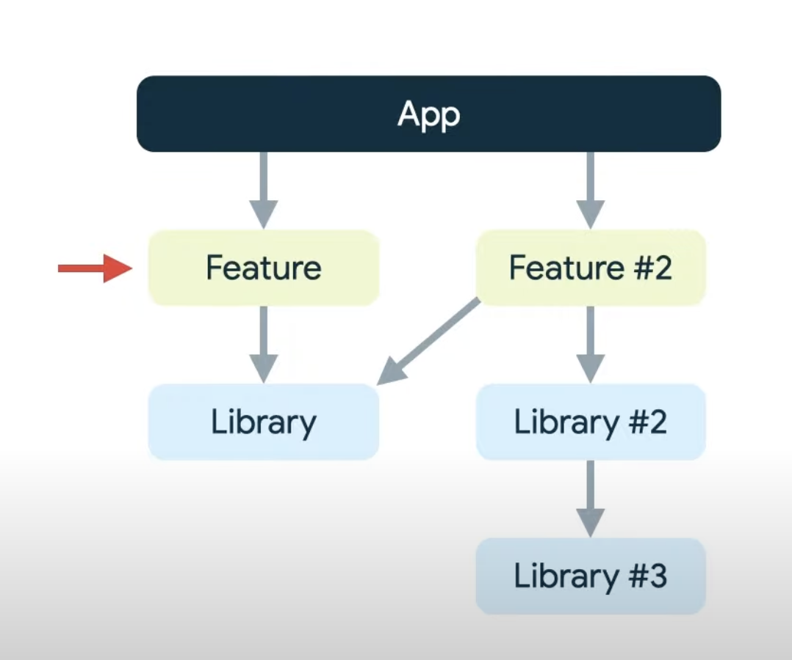

## modules modularity

App can depend on feature modules or library modules.
Feature modules can depend on library modules, but not on other feature modules.
library modules can depend on each other.



## Models do not refer/import anything (part of business core - nothing android related)

Being part of the core, it is more flexible and not framework dependent so easily portable and generic.
These go inside `core` package.

## Domain/core package usually contains -> domain model, repositories, usecases

## repository can refer to models, nothing else (part of business core - nothing android related)

Being part of the core, it is more flexible and not framework dependent so easily portable and generic.
1. declare an interface for dataSource (with the usual CRUD methods)
These also go inside `core` package.

### DataSource interface with CRUD methods (some app class will implement this and delegate these to a DAO)

This also goes inside `core` package.
NoteRepository takes a interface of `DataSource` reference in constructor and hence a dependency of NoteRepository
NoteRepository forwards calls to `DataSource` interface reference that it has

```kt
interface NoteDataSource {
    suspend fun add(note: Note)

    suspend fun get(id: Long): Note?

    suspend fun getAll(): List<Note>

    suspend fun remove(note: Note)
}
```


Repository depends on DataSource which is a DAO like interface (but do not directly depend on DAO). Typically we would have implementers of DataSource, that might use DAO to fulfill the functionality.
```kt
import com.example.core.data.Note

class NoteRepository(private val dataSource: NoteDataSource) {
    suspend fun addNote(note: Note) = dataSource.add(note)

    suspend fun getNote(id: Long) = dataSource.get(id)

    suspend fun getAllNotes() = dataSource.getAll()

    suspend fun removeNote(note: Note) = dataSource.remove(note)
}
```

## Usecases can depend on repository(via constructor)

These also go inside `core` package.
Expose methods that act as use cases.


## Room entities

these go inside `framework.db` package in main module. Note that these entity should be separate from domain model POJOs present in `core`.

### The room entity class will have methods to convert to/from domain model entity prsent in core

```kt
@Entity(tableName = "note")
data class NoteEntity (
    val title: String,
    val content: String,

    @ColumnInfo(name = "creation_date")
    val creationTime: Long,

    @ColumnInfo(name = "update_time")
    val updateTime: Long,

    @PrimaryKey(autoGenerate = true)
    val id: Long = 0L
    ) {

    companion object {
        fun fromNote(note: Note): NoteEntity {
            // id not needed since db itself generates
            return NoteEntity(note.title, note.content, note.creationTime, note.updateTime)
        }
    }

    fun toNote(): Note {
        return Note(title, content, creationTime, updateTime, id)
    }
}
```


## DataSource interface

We can have one data source interface, and one implementation per data source 
e.g.
1. RemoteDataSource extends DataSource
2. LocalDataSource extends DataSource

DataSource can typically expose CRUD methods, and most likely being.
DataSource implementations will most likely be used by a repository.

## Room DAOs

These will also go inside `framework.db` package inside `main` module (And not inside core), since they are tied to room framework.

`NoteDao` only refers to `NoteEntity`, and does not refer/work with `Note`  model object. Why?


## DatabaseSErvice class

The singleton creator/holder of database instance, typically also used to expose DAO object.

## RoomNoteDataSource implements DataSource classes, delegates/forwards to DAO for actual implementation

It will use DAO to implement datasource.
It will get DAO from app level singleton database service.
```kt
class RoomNoteDataSource(context: Context): NoteDataSource {

    val noteDao = DatabaseService.getInstance(context).noteDao()

    override suspend fun add(note: Note) {
        noteDao.addNoteEntity(NoteEntity.fromNote(note))
    }

    override suspend fun get(id: Long): Note? {
        return noteDao.getNoteEntity(id)?.toNote()
    }

    override suspend fun getAll(): List<Note> {
        return noteDao.getAllNoteEntities().map {
            it.toNote()
        }
    }

    override suspend fun remove(note: Note) {
        noteDao.deleteNoteEntity(NoteEntity.fromNote(note))
    }
}
```

## Viewmodels and other classes can refer to usecases instead of repository directly but only introduce extra layer of useCase if you really need to!

Viewmodel would expose methods to UI, which will be called by UI to do some event/data handling.


## Presentation layer/UI controllers can refer to viewmodels (dependency, but managed via observer levels)


## Cases where id is owned/created by DB

in those cases model classes can have an id field but source of truth is db.

Model classes can be used before they are saved in DB and after saved in DB.
e.g. `Note` is used in `saveNote` function in viewmodel.
Before the model classes are persisted by DB, the `id` field in those model classes shall be `0L` which is the default value.
Post persistence, the model classes can hold the actual `id` of the persisted Note.