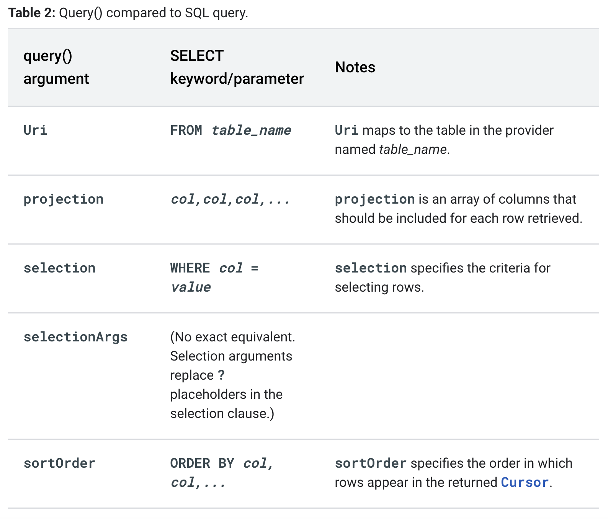

##

https://www.youtube.com/watch?v=fNVMqACYPnQ
https://guides.codepath.com/android/creating-content-providers

## 

It is abstraction over a data system.
An e.g. ContactsProvider for contacts data is present inside Contacts app.

## When to use content provider

You need to build a content provider if you want to provide one or more of the following features:
You want to offer complex data or files to other applications.
You want to allow users to copy complex data from your app into other apps.
You want to provide custom search suggestions using the search framework.
You want to expose your application data to widgets.
You want to implement the AbstractThreadedSyncAdapter, CursorAdapter, or CursorLoader classes.

## DAta storage strategies

1. file storage - expose files
2. structured storage - rdbms/db rows & columns

## API of abstract `ContentProvider`:

```java
    public abstract boolean onCreate();

    public abstract @Nullable Uri insert(@NonNull Uri uri, @Nullable ContentValues values);

    public abstract @Nullable Cursor query(@NonNull Uri uri, @Nullable String[] projection,
            @Nullable String selection, @Nullable String[] selectionArgs,
            @Nullable String sortOrder);

    public abstract int delete(@NonNull Uri uri, @Nullable String selection,
            @Nullable String[] selectionArgs);

    public abstract int update(@NonNull Uri uri, @Nullable ContentValues values,
            @Nullable String selection, @Nullable String[] selectionArgs);

    public abstract @Nullable String getType(@NonNull Uri uri);
```

## Registering content provider with the system

```xml
<!-- AndroidManifest.xml -->
   <provider
          android:name=".MovieProvider"
          android:authorities="com.androidessence.moviedatabase"
          android:exported="false"
          android:protectionLevel="signature"
          android:syncable="true"/>

```

## Content resolver

A component that app uses to request data from content provider, i.e. interface to interact with ContentProvider.
ContentResolver provides methods like `query()`, `insert()`, `update()` and `delete()`.

## Contract class

Public class that contains contentURIs, column names, table names, shared constants.
```java
  /**
   * The Content Authority is a name for the entire content provider, similar to the relationship
   * between a domain name and its website. A convenient string to use for content authority is
   * the package name for the app, since it is guaranteed to be unique on the device.
   */
  public static final String CONTENT_AUTHORITY = "com.androidessence.moviedatabase";

  /**
   * The content authority is used to create the base of all URIs which apps will use to
   * contact this content provider.
   */
  private static final Uri BASE_CONTENT_URI = Uri.parse("content://" + CONTENT_AUTHORITY);

  /**
   * A list of possible paths that will be appended to the base URI for each of the different
   * tables.
   */
  public static final String PATH_MOVIE = "movie";
  public static final String PATH_GENRE = "genre";

```

## Comparision of SQL query vs contentResolver.query()



## Content URI

Content URI is path to data and starts with `content://`. Think of it as table address within the system -> the authority decides the app/provider, and path following the authority decides the table/data source within the provider.

**A content URI is a URI that identifies data in a provider.** Content URIs include the symbolic name of the entire provider (its authority) and a name that points to a table (a path). When you call a client method to access a table in a provider, the content URI for the table is one of the arguments.

The ContentProvider uses the `path part of the content URI to choose the table to access`. A provider usually has a path for each table it exposes.

`content://user_dictionary/words` -> `user_dictionary` string is the provider's authority, and the `words` string is the table's path. Authority is used to decide the provider in the system, and path for table/address.

Many providers allow you to access a single row in a table by appending an ID value to the end of the URI. For example, to retrieve a row whose _ID is 4 from user dictionary, you can use this content URI:

```java
Uri singleUri = ContentUris.withAppendedId(UserDictionary.Words.CONTENT_URI,4);
```

## Getting read access/permission to read provider (the consumer apps)

To retrieve data from a provider, your application needs `read access permission` for the provider. You can't request this permission at run-time; instead, you have to specify that you need this permission in your manifest, using the `<uses-permission>` element and the exact permission name defined by the provider. 
**Consumer app that consumes the provider must add manifest permission**

On provider site declare permission:
e.g.
```xml
    <permission android:name="com.example.balraj.contentproviderapp.provider.READWRITE"/>
```
https://github.com/polltery/Android-content-provider-example/blob/master/app/src/main/AndroidManifest.xml#L5

When you specify this element in your manifest, you are in effect "requesting" this permission for your application. When users install your application, they implicitly grant this request.

e.g. in my app I need to add following to read data from contacts provider:
```xml
    <uses-permission android:name="android.permission.READ_CONTACTS" /> <!-- this is for read acces to contacts provider -->
```

`exported` flag: If a provider's application doesn't specify any permissions, then other applications have no access to the provider's data, unless the provider is exported. 

Additionally, (local components) in the provider's application always have full read and write access, regardless of the specified permissions.

`Read and write permissions`: Unlike the other components, there are two separate permission attributes you can set: android:readPermission restricts who can read from the provider, and android:writePermission restricts who can write to it. Note that if a provider is protected with both a read and write permission, holding only the write permission doesn't mean you can read from a provider.

## Intent based access (Temporary uri permission)

Intents can provide indirect access to a content provider. You allow the user to access data in a provider even if your application doesn't have access permissions, either by getting a result intent back from an application that has permissions, or by activating an application that has permissions and letting the user do work in it.

You can access data in a content provider, even if you don't have the proper access permissions, by sending an intent to an application that does have the permissions and receiving back a result intent containing "URI" permissions. These are permissions for a specific content URI that last until the activity that receives them is finished.

The application that has permanent permissions grants temporary permissions by setting a flag in the result intent:
Read permission: `FLAG_GRANT_READ_URI_PERMISSION`
Write permission: `FLAG_GRANT_WRITE_URI_PERMISSION`

**These flags don't give general read or write access to the provider whose authority is contained in the content URI. The access is only for the URI itself**

you can retrieve data for a contact in the Contacts Provider, even if you don't have the `READ_CONTACTS` permission. 

You might want to do this in an application that sends e-greetings to a contact on their birthday. 

Instead of requesting `READ_CONTACTS`, which gives you access to all of the user's contacts and all of their information, you prefer to let the user control which contacts are used by your application via `ACTION_PICK` and the "contacts" MIME type `CONTENT_ITEM_TYPE`, using the method `startActivityForResult()`.

In the selection activity, the user selects a contact to update. When this happens, the selection activity calls `setResult(resultcode, intent)` to set up an intent to give back to your application. The intent contains the content URI of the contact the user selected, and the "extras" flags `FLAG_GRANT_READ_URI_PERMISSION`. These flags grant URI permission to your app to read data for the contact pointed to by the content URI. The selection activity then calls `finish()` to return control to your application.


## URI permissions

Content providers have an important additional security facility available to them called **URI permissions**
A provider defines URI permissions for content URIs in its manifest, using the `android:grantUriPermission` attribute of the `<provider>` element, as well as the `<grant-uri-permission>` child element of the `<provider>` element.

e.g.
```xml
<provider 
 android:name="com.sample.MyFileProvider" 
 android:authorities="com.mydomain.fileprovider" 
 android:exported="false" 
 android:grantUriPermissions="true">  <!-- need this for uri level permissions -->
    <meta-data 
        android:name="android.support.FILE_PROVIDER_PATHS" 
        android:resource="@xml/file_paths" /> 
 </provider> 
 
```
You can also grant permissions on a per-URI basis. When starting an activity or returning a result to an activity, set the `Intent.FLAG_GRANT_READ_URI_PERMISSION`, intent flag, the `Intent.FLAG_GRANT_WRITE_URI_PERMISSION`, intent flag, or both flags. This gives another app read, write, and read/write permissions, respectively, for the data URI that's included in the intent. The other app gains these permissions for the specific URI regardless of whether it has permission to access data in the content provider more generally.


