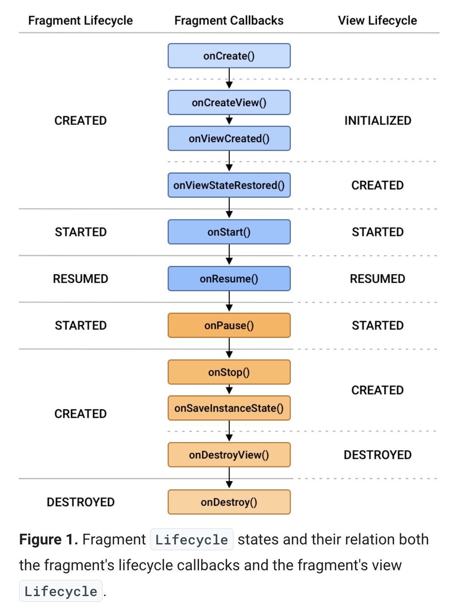

Dont use platform version, only use `androidx` version.

## Fragments

A fragment is a reusable piece of UI; fragments can be reused and embedded in one or more activities.
Basically a peice of UI with some controller logic.
`UI controllers like fragment` control the UI by drawing views on the screen, capturing user events, and anything else related to the UI that the user interacts with. 
Data in the app or any decision-making logic about that data should not be in the UI controller classes

The Android system can destroy UI controllers like fragments at any time based on certain user interactions or because of system conditions like low memory. 
Because these events aren't under your control, you shouldn't store any app data or state in UI controllers e.g. lets say shared state between many fragments.

Fragments introduce modularity and reusability into your activity’s UI by allowing you to divide the UI into discrete chunks.

**You can even show multiple fragments at once on a single screen, such as a master-detail layout for tablet devices**

## Implemented interfaces:
LifecycleOwner, ViewModelStoreOwner

## Using from androidx

```groovy
    // Java language implementation
    implementation("androidx.fragment:fragment:$fragment_version")
    // Kotlin
    implementation("androidx.fragment:fragment-ktx:$fragment_version")
```

## lifecycle summary

To manage lifecycle, `Fragment` implements `LifecycleOwner`, exposing a `Lifecycle` object that you can access through the `getLifecycle()` method.

**A fragment's view has a separate Lifecycle that is managed independently from that of the fragment's Lifecycle.**.
Fragments maintain a separate LifecycleOwner for their view, which can be accessed using `getViewLifecycleOwner()`.

A fragment's lifecycle state can never be greater than its parent. For example, a parent fragment or activity must be started before its child fragments. Likewise, child fragments must be stopped before their parent fragment or activity.



`onCreate()`: The fragment has been instantiated and is in the CREATED state. However, its corresponding view has not been created yet.
`onCreateView()`: This method is where you inflate the layout. The fragment has entered the CREATED state.
`onViewCreated()`: This is called after the view is created. In this method, you would typically bind specific views to properties by calling findViewById(). This is where you can bind views and setup view stuff like layoutadapters, api calls, click listeners.
`onStart()`: The fragment has entered the STARTED state.
`onResume()`: The fragment has entered the RESUMED state and now has focus (can respond to user input).
`onPause()`: The fragment has re-entered the STARTED state. The UI is visible to the user
`onStop()`: The fragment has re-entered the CREATED state. The object is instantiated but is no longer presented on screen.
`onDestroyView()`: Called right before the fragment enters the DESTROYED state. The view has already been removed from memory, but the fragment object still exists.
`onDestroy()`: The fragment enters the DESTROYED state.

## Declaring fragments in XML only

```xml
    <fragment
        android:id="@+id/title_destination"
        android:name="com.example.android.guesstheword.screens.title.TitleFragment"
        android:label="title_fragment"
        tools:layout="@layout/title_fragment">
    </fragment>
```
and corresponding `TitleFragment` class:
```kt
class TitleFragment : Fragment() {
    override fun onCreateView(inflater: LayoutInflater, container: ViewGroup?,
                              savedInstanceState: Bundle?): View {
        // Inflate the layout for this fragment
        val binding: TitleFragmentBinding = DataBindingUtil.inflate(
                inflater, R.layout.title_fragment, container, false)

        binding.playGameButton.setOnClickListener {
            findNavController().navigate(TitleFragmentDirections.actionTitleToGame())
        }
        return binding.root
    }
}
```

`Note`: prefer `XYZViewBinding/Databinding` inflater given from XML generated Viewbinding class e.g.
```kt
    override fun onCreateView(
        inflater: LayoutInflater,
        container: ViewGroup?,
        savedInstanceState: Bundle?
    ): View? {
        // use the xml binding auto generated class inflater
        val wordListBinding: FragmentWordListBinding =  FragmentWordListBinding.inflate(inflater, container, false)
        return wordListBinding.root
    }
```

## onInflate

Called when a fragment is being created as part of a view layout inflation, typically from setting the content view of an activity. This may be called immediately after the fragment is created from a `FragmentContainerView` in a layout file. Note this is before the fragment's onAttach has been called; all you should do here is parse the attributes and save them away.

This is called the first time the fragment is inflated. If it is being inflated into a new instance with saved state, this method will not be called a second time for the restored state fragment.

## onCreateView

`onCreateView(LayoutInflater, ViewGroup, Bundle)` creates and returns the view hierarchy associated with the fragment.

## Creating fragments

```kotlin
class ExampleFragment : Fragment(R.layout.example_fragment)
```

## Adding fragment to activity via XML

To declaratively add a fragment to your activity layout's XML, use a `FragmentContainerView` element.

```xml
<!-- res/layout/example_activity.xml -->
<androidx.fragment.app.FragmentContainerView
    xmlns:android="http://schemas.android.com/apk/res/android"
    android:id="@+id/fragment_container_view"
    android:layout_width="match_parent"
    android:layout_height="match_parent"
    android:name="com.example.ExampleFragment" />
```
The `android:name` attribute specifies the class name of the Fragment to instantiate. 

When the activity's layout is inflated, the specified fragment is instantiated, `onInflate()` is called on the newly instantiated fragment, and a FragmentTransaction is created to add the fragment to the FragmentManager.

**Note** - Avoid using the `<fragment>` tag to add a fragment using XML, as the `<fragment>` tag allows a fragment to move beyond the state of its FragmentManager. Instead, always use FragmentContainerView for adding a fragment using XML.


## Adding fragment to activity programmatically

To programmatically add a fragment to your activity's layout, the layout should include a `FragmentContainerView` to serve as a fragment container, as shown in the following example:

```xml
<!-- res/layout/example_activity.xml -->
<androidx.fragment.app.FragmentContainerView
    xmlns:android="http://schemas.android.com/apk/res/android"
    android:id="@+id/fragment_container_view"
    android:layout_width="match_parent"
    android:layout_height="match_parent" />
```

a `FragmentTransaction` is used to instantiate a fragment and add it to the activity's layout.

In your `FragmentActivity`, you can get an instance of the `FragmentManager`, which can be used to create a `FragmentTransaction`.

## Fragment manager and transactions

At runtime, a `FragmentManager` can add, remove, replace, and perform other actions with fragments in response to user interaction. 

Each set of fragment changes that you commit is called a transaction, and you can specify what to do inside the transaction using the APIs provided by the `FragmentTransaction` class.

 You can group multiple actions into a single transaction—for example, a transaction can add or replace multiple fragments. This grouping can be useful for when you have multiple sibling fragments displayed on the same screen, such as with split views.

## Sharing data between fragments

You can have a shared viewmodel on activity scope, which can be shared between all the fragments inside that activity.

## FragmentFactory

https://proandroiddev.com/android-fragments-fragmentfactory-ceec3cf7c959

class used to control the instantiation of Fragment instances.

Traditionally, a Fragment instance could only be instantiated using its default empty constructor. This is because the system would need to reinitialize it under certain circumstances like configuration changes and the app’s process recreation. If it weren’t for the default constructor restriction, the system wouldn’t know how to reinitialize the Fragment instance.

If your Fragment has a non-empty constructor, you will need to create a FragmentFactory that will handle initializing it.

Fragments are managed by FragmentManagers, so it’s only natural that the `FragmentFactory needs to be attached to a FragmentManager in order to be used`

To provide dependencies to your fragment, or to use any custom constructor, you must instead create a custom FragmentFactory subclass and then override FragmentFactory.instantiate. You can then override the FragmentManager's default factory with your custom factory, which is then used to instantiate your fragments.

E.g. DessertsFragment depends on DessertsRepository
```java
public class DessertsFragment extends Fragment {
    private DessertsRepository dessertsRepository;

    public DessertsFragment(DessertsRepository dessertsRepository) {
        super();
        this.dessertsRepository = dessertsRepository;
    }

    // Getter omitted.

    ...
}
```

Fragment factory for injecting fragment dependencies

```java
public class MyFragmentFactory extends FragmentFactory {
    private DessertsRepository repository;

    public MyFragmentFactory(DessertsRepository repository) {
        super();
        this.repository = repository;
    }

    // note custom implementation
    @NonNull
    @Override
    public Fragment instantiate(@NonNull ClassLoader classLoader, @NonNull String className) {
        Class<? extends Fragment> fragmentClass = loadFragmentClass(classLoader, className);
        if (fragmentClass == DessertsFragment.class) {
            return new DessertsFragment(repository);
        } else {
            return super.instantiate(classLoader, className);
        }
    }
}
```

Registering custom fragmentfactory:
```java
public class MealActivity extends AppCompatActivity {
    @Override
    protected void onCreate(@Nullable Bundle savedInstanceState) {
        DessertsRepository repository = DessertsRepository.getInstance();
        getSupportFragmentManager().setFragmentFactory(new MyFragmentFactory(repository));
        super.onCreate(savedInstanceState);
    }
}
```

## `viewModels()` extension on `Fragment` class

This is one more way to get viewmodel in a fragment, other than using `ViewModelProvider(fragInstance).get(ModelClass)`.
Returns a Lazy ViewModel, to which delegation can happen.

```kt
public inline fun <reified VM : ViewModel> Fragment.viewModels(
    noinline ownerProducer: () -> ViewModelStoreOwner = { this },
    noinline factoryProducer: (() -> Factory)? = null
): Lazy<VM> = createViewModelLazy(VM::class, { ownerProducer().viewModelStore }, factoryProducer)
```

Why use it?
We want to own instantiation of the ViewModel, instead delegate it to `Fragments.viewModels` extension:
The delegate class creates the viewModel object for you on the first access, and retains its value through configuration changes and returns the value when requested.

### Can't access ViewModels from detached fragment

If I try to access the lazy ViewModel returned from `viewModels` extension, before it is the fragment is attached,
I will get following error:
```
    init {
        Log.d("Gamefragment", "fragment init viewmodel = "+viewModel)
    }

        Caused by: java.lang.IllegalStateException: Can't access ViewModels from detached fragment
        at androidx.fragment.app.Fragment.getDefaultViewModelProviderFactory(Fragment.java:427)
        at androidx.fragment.app.FragmentViewModelLazyKt$createViewModelLazy$factoryPromise$1.invoke(FragmentViewModelLazy.kt:95)
        at androidx.fragment.app.FragmentViewModelLazyKt$createViewModelLazy$factoryPromise$1.invoke(Unknown Source:0)
        at androidx.lifecycle.ViewModelLazy.getValue(ViewModelProvider.kt:52)
        at androidx.lifecycle.ViewModelLazy.getValue(ViewModelProvider.kt:41)
        at com.example.android.unscramble.ui.game.GameFragment.getViewModel(GameFragment.kt:38)
        at com.example.android.unscramble.ui.game.GameFragment.<init>(GameFragment.kt:41)
```

### lazy Viewmodel can be accessed in `onAttach` and `onCreate`

```kt
    override fun onAttach(context: Context) {
        super.onAttach(context)
        Log.d("GameFragment", "onAttach callback, viewmodel = " + viewModel)
    }

    override fun onCreate(savedInstanceState: Bundle?) {
        super.onCreate(savedInstanceState)
        Log.d("GameFragment", "onCreate callback, viewmodel = " + viewModel)
    }

 D/GameFragment: onAttach callback, viewmodel = com.example.android.unscramble.ui.game.GameViewModel@a42443d
 D/GameFragment: onCreate callback, viewmodel = com.example.android.unscramble.ui.game.GameViewModel@a42443d
```

## Destroy vs Detach

when a Fragment is detached, its `onPause`, `onStop` and `onDestroyView` methods are called only (in that order). 

On the other hand, when a Fragment is removed, its `onPause`, `onStop`, `onDestroyView`, `onDestroy` and `onDetach` methods are called (in that order). 

Similarly, when attaching, the Fragment's `onCreateView`, `onStart` and `onResume` methods are called only; 
and when adding, the Fragment's `onAttach`, `onCreate`, `onCreateView`, `onStart` and `onResume` methods are called (in that order).

So attaching/detaching does not call onCreate/onDestroy and onAttach/onDetach
But add/remove adds calls like onCreate/onDestroy and onAttach/onDetach.

## Why onAttach is called before onCreate?

https://stackoverflow.com/questions/29677812/why-is-onattach-called-before-oncreate

`onAttach()` assigns hosting activity to the Fragment. If it had been called after `onCreate()` then there would be no context for your fragment (`getActivity()` would return null) and you would not be able to do anything in `onCreate()` method without that context anyway.

Another fitting reason is that Fragment's lifecycle is similar to Activity's lifecycle. In `Activity.attach()` activity gets attached to its parent (a window). Similarly in `Fragment.onAttach()` fragment gets attached to its parent (an activity), before any other initialization is done. Note, `Activity.attach()` happens before `Activity.onCreate`, but `onAttachedToWindow` callback is called from `performTraversals` which is late.


## Fragment and viewmodel init order log

Viewmodel init happens after fragment -> init -> attach -> onCreate.
```
2022-06-05 17:44:30.513 11388-11388/com.example.android.unscramble D/GameFragment: init!
2022-06-05 17:44:30.517 11388-11388/com.example.android.unscramble D/GameFragment: onAttach
2022-06-05 17:44:30.518 11388-11388/com.example.android.unscramble D/GameFragment: onCreate
2022-06-05 17:44:30.519 11388-11388/com.example.android.unscramble D/MainActivity: onCreate
2022-06-05 17:44:30.545 11388-11388/com.example.android.unscramble D/GameViewModel: init
2022-06-05 17:44:30.546 11388-11388/com.example.android.unscramble D/GameFragment: GameFragment View created/re-created!
2022-06-05 17:44:30.569 11388-11388/com.example.android.unscramble D/MainActivity: onAttachedToWindow
```