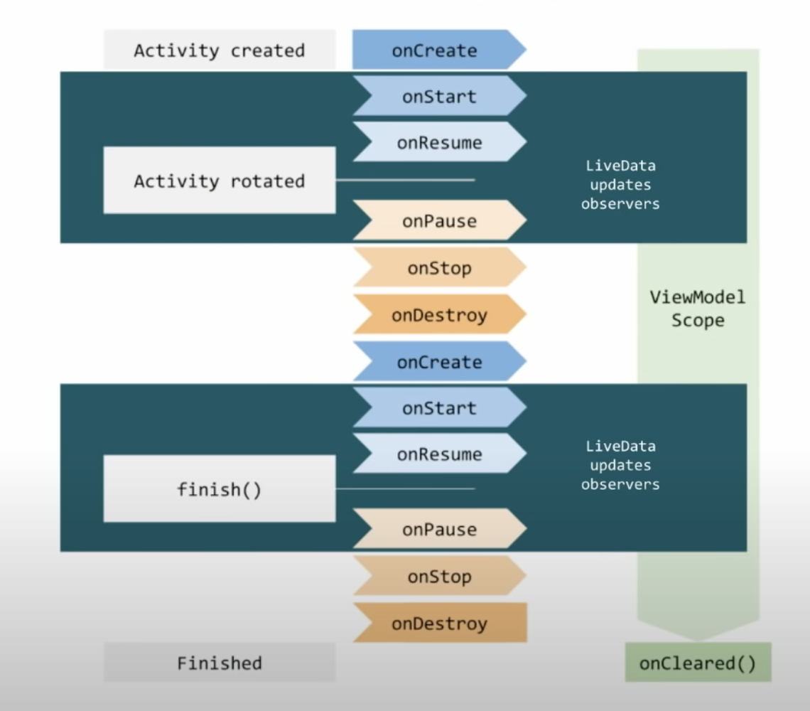

https://www.youtube.com/watch?v=B8ppnjGPAGE

https://medium.com/androiddevelopers/viewmodel-one-off-event-antipatterns-16a1da869b95

##

LiveData is an **lifecycle aware observable data holder (abstract) class**. 
LiveData is observable, which means that an observer is notified when the data held by the LiveData object changes.

Unlike a regular observable, **LiveData is lifecycle-aware**, meaning it respects the lifecycle of other app components, such as activities, fragments, or services. 

The LiveData only updates observers that are in an active lifecycle state such as `STARTED` or `RESUMED`.

This awareness ensures LiveData only updates app component observers that are in an active lifecycle state.

`Note`: Activities and fragments should not hold LiveData instances because their role is to display data, not hold state. Also, keeping activities and fragments free from holding data makes it easier to write unit tests.

## Why use LiveData?

Without livedata, we will have to call a bunch of `update` methods on any UI event or model change, 
and these update methods will query latest viewmodel for latest data to draw/paint on screen.

`LiveData` introduces a observable viewmodel into picture, and observe/react to viewmodel changes by exposing viewmodel state as a observable livedata instead of static data.

## Observer class

In `androidx.lifecycle.Observer`
A simple callback that can receive from LiveData.

```kt
interface Observer {
    fun onChanged(T t)
}
```

## Adding LiveData Observers

You usually attach the Observer object in a UI controller, such as an activity or fragment.

The method name on `LiveData` is `observe`, but it can hold many observers, like an eventemitter.addListener.
```kt
fun observe(@NonNull LifecycleOwner owner, @NonNull Observer<Object> observer)
```
The `observe() method takes a LifecycleOwner object`.
Adds the given observer to the observers list within the lifespan of the given owner.

Example:
```kt
        // In onViewCreated()
        // Create the observer which updates the UI.
        final Observer<String> nameObserver = new Observer<String>() {
            @Override
            public void onChanged(@Nullable final String newName) {
                // Update the UI, in this case, a TextView.
                nameTextView.setText(newName);
            }
        };

        // Observe the LiveData, passing in this activity as the LifecycleOwner and the observer.
        model.getCurrentName().observe(this, nameObserver);// this is the fragment/activity UI controller
```

### When is `onChanged` called?

After `observe()` is called with nameObserver passed as parameter, `onChanged()` is immediately invoked providing the most recent value stored in `mCurrentName`. 

If the `LiveData` object hasn't set a value in mCurrentName, `onChanged()` is not called.

## updating LiveData objects

`LiveData` itself does not expose mutation methods.
For LiveData that changes, use `MutableLiveData` that exposes `setValue(T)` and `postValue(T)` publicly.

### setValue(T) for main thread vs postValue(T) for worker threads

You must call the `setValue(T)` method to update the LiveData object from the main thread. 

If the code is executed in a worker thread, you can use the `postValue(T)` method instead to update the LiveData object.

## Accessing value of a LiveData object

To access the data within a LiveData object, use the `value` property (this is kotlin shorthand for setter and getter `setValue` and `getValue`).

For java, use `setValue(T)` and `T getValue()` respectively. 

## When should we setup observer on LiveData references?

`onViewCreated()` is a sensible place to setup observer on LiveData objects.

## Lifecycle awareness



## Prefer observing via viewLifecycleOwner in Fragments

```kt
// Inside a fragment
//...
    onViewCreated(){
        viewModel.currentScrambledWord.observe(viewLifecycleOwner) {
            binding.textViewUnscrambledWord.text = it.toString()
    }
// ...
```

## State exposing pattern, Mutable reference locally, Immutable reference shared out of class

```kt
class MyViewModel{
    
    private val _score = MutableLiveData<Int>() // mutable state is local, modifiable only through local methods
    val score: LiveData<Int>         // public state is immutable, but can be observed via attaching observer
        get() = _score

    // ...
}
```

## LiveData and Databinding

In simpler terms Data binding is binding data (from code) to views + view binding (binding views to code)

helps map/reference app data values in views.
It binds  from data sources in app to UI components in layout.

Example:
```kt
binding.textViewUnscrambledWord.text = viewModel.currentScrambledWord
```
Example using data binding in layout file
```xml
android:text="@{gameViewModel.currentScrambledWord}"
```


## Problem: what if viewmodel livedata wants to listen to repository LiveData?

THe reason for problem: LiveData is associated with lifecyleowner like fragment/activity, but we dont have access to fragment/activity in our viewmodel.

https://medium.com/androiddevelopers/viewmodels-and-livedata-patterns-antipatterns-21efaef74a54

## Cleanup of observers

The lifecycle awareness automatically cleans up observers (on lifecycleowner destroy events)

## How LiVeData.observe works?

```java
    public void observe(@NonNull LifecycleOwner owner, @NonNull Observer<? super T> observer) {
        assertMainThread("observe");
        if (owner.getLifecycle().getCurrentState() == DESTROYED) {
            // ignore
            return;
        }
        LifecycleBoundObserver wrapper = new LifecycleBoundObserver(owner, observer);
        ObserverWrapper existing = mObservers.putIfAbsent(observer, wrapper);
        if (existing != null && !existing.isAttachedTo(owner)) {
            throw new IllegalArgumentException("Cannot add the same observer"
                    + " with different lifecycles");
        }
        if (existing != null) {
            return;
        }
        owner.getLifecycle().addObserver(wrapper);
    }
```

## LiveData transformations

Any derived state from live data can be calculated using Transformations.

These methods permit functional composition and delegation of LiveData instances. The transformations are calculated lazily, and **will run only when the returned LiveData is observed**. 
`Lifecycle behavior is propagated from the input sourceLiveData to the returned one`.

e.g. formatted date, filtering based on selection, sum of values, last item etc.

e.g.
```kt
private val _price = MutableLiveData<Double>()
val price: LiveData<String> = Transformations.map(_price) {
   NumberFormat.getCurrencyInstance().format(it)
}
```

## How lifecycle connects with LiveData Observer ?

```java
    class LifecycleBoundObserver extends ObserverWrapper implements LifecycleEventObserver {
        @NonNull
        final LifecycleOwner mOwner;

        LifecycleBoundObserver(@NonNull LifecycleOwner owner, Observer<? super T> observer) {
            super(observer);
            mOwner = owner;
        }

        @Override
        boolean shouldBeActive() {
            return mOwner.getLifecycle().getCurrentState().isAtLeast(STARTED);
        }

        @Override
        public void onStateChanged(@NonNull LifecycleOwner source,
                @NonNull Lifecycle.Event event) {
            Lifecycle.State currentState = mOwner.getLifecycle().getCurrentState();
            if (currentState == DESTROYED) {
                removeObserver(mObserver);// cleanup observer
                return;
            }
            Lifecycle.State prevState = null;
            while (prevState != currentState) {
                prevState = currentState;
                activeStateChanged(shouldBeActive());
                currentState = mOwner.getLifecycle().getCurrentState();
            }
        }

        @Override
        boolean isAttachedTo(LifecycleOwner owner) {
            return mOwner == owner;
        }

        @Override
        void detachObserver() {
            mOwner.getLifecycle().removeObserver(this);
        }
    }

    private abstract class ObserverWrapper {
        final Observer<? super T> mObserver;
        boolean mActive;
        int mLastVersion = START_VERSION;

        ObserverWrapper(Observer<? super T> observer) {
            mObserver = observer;
        }

        abstract boolean shouldBeActive();

        boolean isAttachedTo(LifecycleOwner owner) {
            return false;
        }

        void detachObserver() {
        }

        void activeStateChanged(boolean newActive) {
            if (newActive == mActive) {
                return;
            }
            // immediately set active state, so we'd never dispatch anything to inactive
            // owner
            mActive = newActive;
            changeActiveCounter(mActive ? 1 : -1);
            if (mActive) {
                dispatchingValue(this);
            }
        }
    }

```

