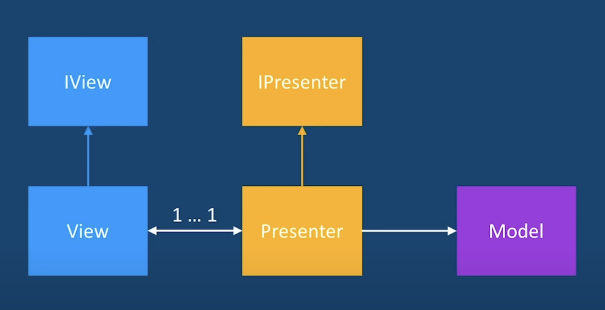

https://www.youtube.com/watch?v=QrbhPcbZv0I

## Model

data classes holding data and business logic
Can be exposed via interfaces like `IUserModel` to hide internals.

## View

UI classes used to show data e.g. Button, Text, Image etc.
All the content is props driven and comes from outside for extreme re-usability.

Should expose a `IView` interface for complex UI internals

## Presenter

**Holds reference to both model and view and does all the co-ordination back and forth**.
Can expose interface like `IPresenter` for view and model?

