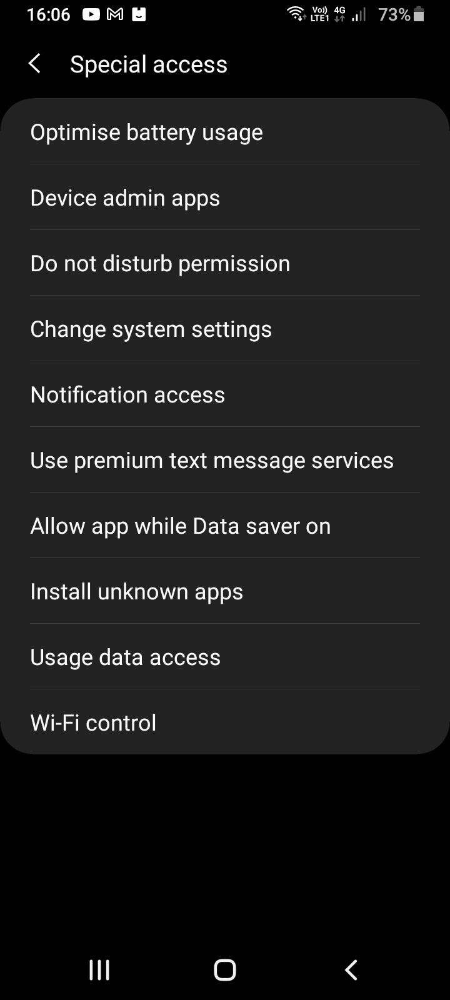

## Runtime permissions (dangerous permissions)

All permissions listed here: https://developer.android.com/reference/android/Manifest.permission

Many runtime permissions access private user data, a special type of restricted data that includes potentially sensitive information. Examples of private user data include location and contact information.

The microphone and camera provide access to particularly sensitive information.

`POST_NOtifications` is a newly added dangerous permission in Android Tiramisu.

`RECEIVE_SMS`, `SEND_SMS` are dangerous.
`WRITE_CALENDAR`, `READ_CALENDAR` are dangerous.

`WRITE_EXTERNAL_STORAGE`: Allows an application to write to external storage. Starting in API level 19, this permission is not required to read/write files in your application-specific directories returned by `Context.getExternalFilesDir(String)` and `Context.getExternalCacheDir()`.

`ACCESS_BACKGROUND_LOCATION + ACCESS_COARSE_LOCATION/ACCESS_FINE_LOCATION`: Allows an app to access location in the background. If you're requesting this permission, you must also request either `ACCESS_COARSE_LOCATION` or `ACCESS_FINE_LOCATION`. Requesting this permission by itself doesn't give you location access.

## Special permissions

The `Special app` access page in system settings contains a set of user-toggleable operations. Many of these operations are implemented as special permissions.
These will contain permissions like drawing over other apps, ignore battery optimization and other special actions.

The system assigns the `appop` protection level to special permissions.

Examples include:
1. `MANAGE_EXTERNAL_STORAGE`: Allows an application a broad access to external storage in scoped storage. Intended to be used by few apps that need to manage files on behalf of the users.

2. `MANAGE_MEDIA`: Allows an application to modify and delete media files on this device or any connected storage device without user confirmation. Applications must already be granted the READ_EXTERNAL_STORAGE or MANAGE_EXTERNAL_STORAGE} permissions for this permission to take effect. This permission doesn't give read or write access directly. It only prevents the user confirmation dialog for these requests.

3. `SYSTEM_ALERT_WINDOW`: Allows an app to create windows using the type WindowManager.LayoutParams.`TYPE_APPLICATION_OVERLAY`, shown on top of all other apps. Very few apps should use this permission; these windows are intended for system-level interaction with the user.
`Note`: If the app targets API level 23 or higher, the app user must explicitly grant this permission to the app through a permission management screen. The app requests the user's approval by sending an intent with action Settings.ACTION_MANAGE_OVERLAY_PERMISSION. The app can check whether it has this authorization by calling Settings.canDrawOverlays().

4. `WRITE_SETTINGS`: Allows an application to read or write the system settings.

## Activity permissions

Permissions applied using the android:permission attribute to the `<activity>` tag in the manifest restrict who can start that Activity. The permission is checked during `Context.startActivity()` and `Activity.startActivityForResult()`. If the caller doesn't have the required permission, then a SecurityException occurs.

## Service permissions

Permissions applied using the android:permission attribute to the `<service>` tag in the manifest restrict who can start or bind to the associated Service. The permission is checked during `Context.startService()`, `Context.stopService()` and `Context.bindService()`. If the caller doesn't have the required permission, then a SecurityException occurs.

## Content provider and permissions

### URI permissions

Content providers have an important additional security facility available to them called `URI permissions`.

