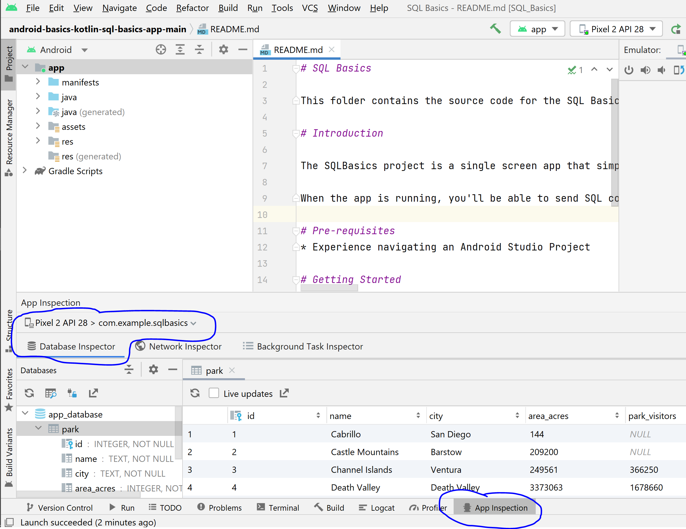
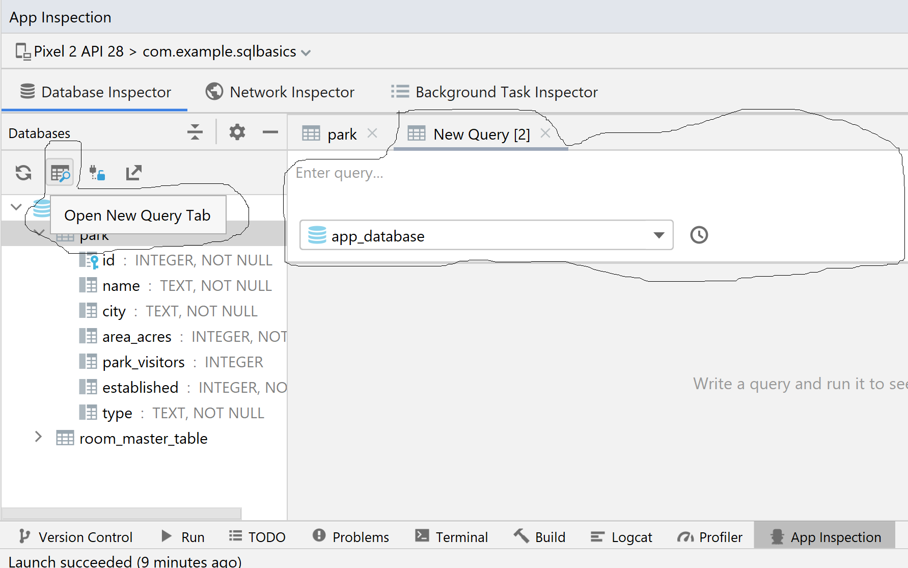

## Where to inspect database ?

App Inspection > Database Inspector



### How to do queries ?

Open new query tab which is one of the options



## Aggregate functions

SUM, COUNT, MAX

## Distinct

The SELECT DISTINCT statement is used to return only distinct (different) values. t's semantically equivalent to a GROUP BY where all returned fields are in the GROUP BY clause.
E.g.
`select city from PARK group by city;` is equivalent to `select distinct city from PARK`;

Inside a table, a column often contains many duplicate values; and sometimes you only want to list the different (distinct) values.

**NULL is considered a unique value, meaning it will get returned when using the DISTINCT keyword**

Syntax:
```
SELECT DISTINCT column_name1, column_name2,... // this will find unique rows with given column combination
FROM table_name;
```

**DISTINCT can be used with aggregated functions and can be applied on only one field in that case**

Count distinct is a common and useful operation
e.g. `SELECT COUNT(DISTINCT id) FROM sql_distinct;`

Another one:
`SELECT MAX(DISTNCT ID), Roles, FirstName, LastName FROM UserNames, LastName`


HOw it works:
* A SELECT DISTINCT statement first builds our overall result set with all records, i.e including duplicate values based on FROM, JOIN, WHERE, HAVING, etc statements.
* Next, it sorts the result set based on the column_name or field with which DISTINCT has been used.
* Then it performs de-duplication (i.e. removes any duplicate values) on the overall result set which was prepared in the first step.

