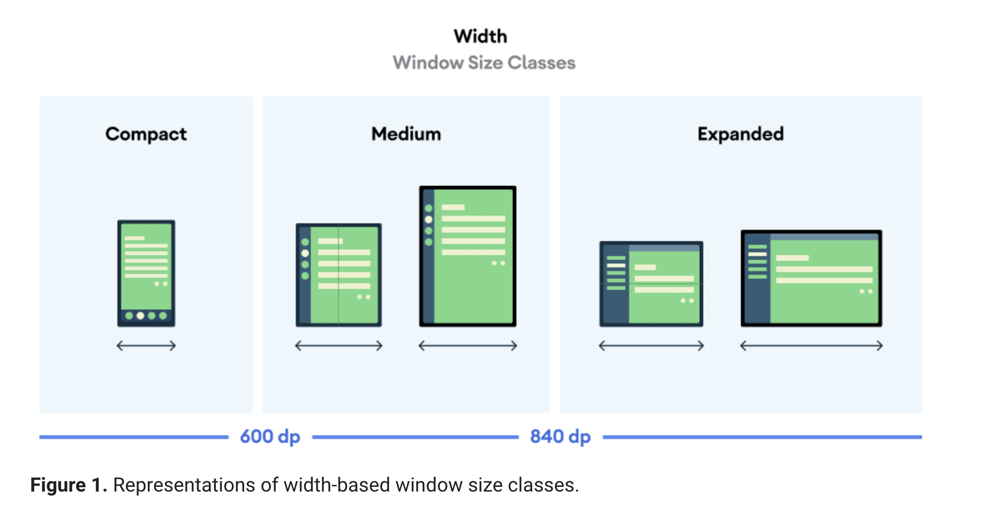
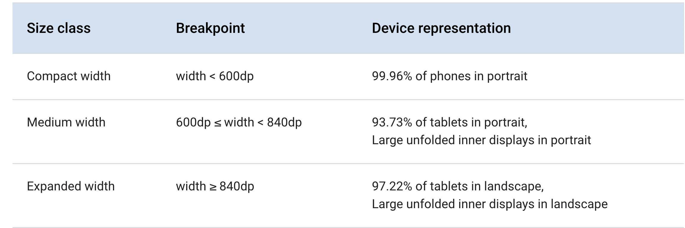

**The screen size as it's known to your app is not the actual size of the device screen**—it takes into account the screen orientation, system decorations (such as the navigation bar), and window configuration changes.

## Flexibility in layouts

**avoid hard-coding the position and size of your UI components** - possible to align on parent/siblings or wrap on content, or use percentages.

Instead, allow view sizes to stretch and specify view positions relative to the parent view or other sibling views so your intended order and relative sizes remain the same as the layout grows.


## Alternative layouts specification (selected by OS based on configuration)

Android allows you to provide alternative layout files that the system applies at runtime based on the current device's screen size.

e.g. only show listview in mobile, and master-detail layout in tablet.

https://developer.android.com/guide/topics/large-screens/support-different-screen-sizes#adaptive_design

## Window size classes

**Available width is usually more important than available height due to the ubiquity of vertical scrolling**, so the width window size class will likely be more relevant to your app’s UI.

Window size classes categorize the display area available to your app as compact, medium, or expanded. 

**Available width and height are classified separately, so at any point in time, your app has two window size classes—one for width, one for height**






### Window size class is dynamic (changes at runtime/config change)

**The window size class can change throughout the lifetime of your app.** While your app is running, device orientation changes, multitasking, and folding/unfolding can change the amount of screen space available. As a result, the window size class is dynamic, and your app’s UI should adapt accordingly.

Function to calculate window size class at runtime:
```java
private void computeWindowSizeClasses() {
    WindowMetrics metrics = WindowMetricsCalculator.getOrCreate()
            .computeCurrentWindowMetrics(this);

    float widthDp = metrics.getBounds().width() /
            getResources().getDisplayMetrics().density;
    WindowSizeClass widthWindowSizeClass;

    if (widthDp < 600f) {
        widthWindowSizeClass = WindowSizeClass.COMPACT;
    } else if (widthDp < 840f) {
        widthWindowSizeClass = WindowSizeClass.MEDIUM;
    } else {
        widthWindowSizeClass = WindowSizeClass.EXPANDED;
    }
    // Use widthWindowSizeClass and heightWindowSizeClass.
}
```

## Screen densities (in dpi = dots per inch)

Calculate pixels from screen density(dpi) and dp (density independent pixels or a point/dot)
Note: high density devices would have more pixels per for same physical size.

A logical pixel or a dot or a point has only one meaning - undivided color.
All designs/layouts should be made with logical pixels in mind.

Almost all phones (with different screen densities and physical sizes), will have same logical device width (e.g. 360dp) and hence makes most sense to design according to that.

```
px = dp * (dpi / 160)
// real pixels = logical pixels * scaling factor
```

Scaling factor formula: `devicedpi/160`.
e.g. xhdpi(320dpi) will have scaling factor of (320/160) = 2.

https://screensiz.es/phone -> device width is device width in dp/points

To learn more visit: https://www.youtube.com/watch?v=zhszwkcay2A&t=1s

## Stretchable images

9 patch PNGs - To solve this, Android supports nine-patch bitmaps in which **you specify small pixel regions that are stretchable—the rest of the image remain unscaled.**

## Alternative bitmaps

To ensure your images appear at their best on all screens, you should provide alternative bitmaps to match each screen density. i.e. high density -> larger images needed (since images are raw pixel info).

Android scales them up when on a high-density screen so that the image occupies the same physical space on the screen. This can cause visible scaling artifacts in bitmaps. So your app should include alternative bitmaps at a higher resolution.

**you should follow the 3:4:6:8:12:16 scaling ratio between the six primary densities**

**mdpi** is baseline density.

| Density qualifier	| Description|
| :---: | --- |
| ldpi |	Resources for low-density (ldpi) screens (~120dpi). |
| mdpi |	Resources for medium-density (mdpi) screens (~160dpi). (This is the baseline density.) |
| hdpi |	Resources for high-density (hdpi) screens (~240dpi). |
| xhdpi |	Resources for extra-high-density (xhdpi) screens (~320dpi). |
| xxhdpi |	Resources for extra-extra-high-density (xxhdpi) screens (~480dpi). |
| xxxhdpi |	Resources for extra-extra-extra-high-density (xxxhdpi) uses (~640dpi). |
| nodpi |	Resources for all densities. These are density-independent resources. The system does not scale resources tagged with this qualifier, regardless of the current screen's density. |

For example, if you have a bitmap drawable that's 48x48 pixels for medium-density screens, all the different sizes should be:

* 36x36 (0.75x) for low-density (ldpi)
* 48x48 (1.0x baseline) for medium-density (mdpi)
* 72x72 (1.5x) for high-density (hdpi)
* 96x96 (2.0x) for extra-high-density (xhdpi)
* 144x144 (3.0x) for extra-extra-high-density (xxhdpi)
* 192x192 (4.0x) for extra-extra-extra-high-density (xxxhdpi)


### drawable vs mipmap directory

Unlike the drawable directory, all mipmap directories are retained in the APK even if you build density-specific APKs. This allows launcher apps to pick the best resolution icon to display on the home screen.


## density independent pixels (think percentages)

The Android system helps you achieve density independence by providing density-independent pixels (dp or dip) as a unit of measurement that you should use instead of pixels (px).


## Responsive design

### ConstraintLayout (like AutoLayout in ios)

https://developer.android.com/guide/topics/large-screens/support-different-screen-sizes#ConstraintLayout


## Large screens stuff

https://developer.android.com/guide/topics/large-screens/get-started-with-large-screens

Test cases for quality - https://developer.android.com/docs/quality-guidelines/large-screen-app-quality


## Screen compatibility mode

Screen compatibility mode is a last resort for apps that are not properly designed to take advantage of larger screen sizes. This is not a mode you should want your app to run in since it offers a suboptimal user experience. There are two different versions of screen compatibility mode based on the device version the app is running on.

On Android versions 1.6 to 3.1 the system runs your application in a "postage stamp" window. It emulates a 320dp x 480dp screen with a black border that fills the remaining area of the screen.

**On Android 3.2 and up the system draws the layout as it would on a 320dp x 480dp screen then scales it up to fill the screen. This will often cause artifacts such as blurring and pixelation in your UI.**

