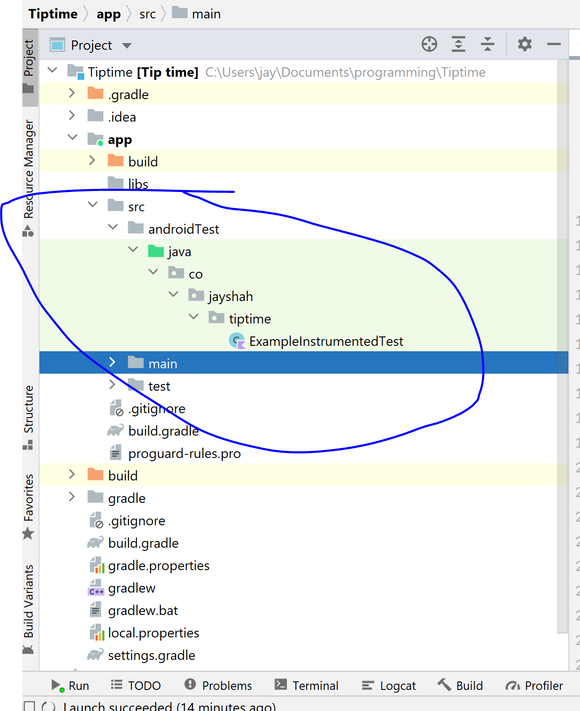

## What are Instrumentation tests?

These tests run on actual devices, not in jdk or laptop. although they will run slowly.

## How they work?

The Android Plug-in for Gradle builds a test app based on your test code, then loads the test app on the same device as the target app.

## Instrumentation explained

Android instrumentation is a set of control methods or "hooks" in the Android system. These hooks control an Android component independently of its normal lifecycle. They also control how Android loads applications.

Normally, an Android component runs in a lifecycle determined by the system. For example, an Activity object's lifecycle starts when the Activity is activated by an Intent. The object's onCreate() method is called, followed by onResume(). When the user starts another application, the onPause() method is called. If the Activity code calls the finish() method, the onDestroy() method is called. The Android framework API does not provide a way for your code to invoke these callback methods directly, but you can do so using instrumentation.

Also, the system runs all the components of an application into the same process. You can allow some components, such as content providers, to run in a separate process, but you can't force an application to run in the same process as another application that is already running.

With Android instrumentation, though, you can invoke callback methods in your test code. This allows you to run through the lifecycle of a component step by step, as if you were debugging the component. The following test code snippet demonstrates how to use this to test that an Activity saves and restores its state:


## Testing options for UI testing

1. Espresso - https://developer.android.com/training/testing/espresso
2. Jetpack compose - https://developer.android.com/jetpack/compose/testing
3. UI Automater - https://developer.android.com/training/testing/ui-automator
4. Roboelectric - http://robolectric.org/

## Dependencies to run instrumentation tests

dependency configuration name starts with `androidTestImplementation`
We use androidx test runner

In `build.gradle`
```groovy
dependencies {
    androidTestImplementation "androidx.test:core:$androidXTestVersion0"
    androidTestImplementation "androidx.test:runner:$androidXTestVersion"
    androidTestImplementation "androidx.test:rules:$androidXTestVersion"
    
    // Brings in AndroidJUnit4
    androidTestImplementation "androidx.test.ext:junit:$testJunitVersion"

    // Optional -- UI testing with Espresso
    androidTestImplementation "androidx.test.espresso:espresso-core:$espressoVersion"
    // Optional -- UI testing with UI Automator
    androidTestImplementation "androidx.test.uiautomator:uiautomator:$uiAutomatorVersion"
    // Optional -- UI testing with Compose
    androidTestImplementation "androidx.compose.ui:ui-test-junit4:$compose_version"
}
```

### Specifying the test instrumentation runner in build config

In `module/build.gradle`
```groovy
android {
    defaultConfig {
        testInstrumentationRunner "androidx.test.runner.AndroidJUnitRunner"
    }
}
```


## Where are instrumentation tests written?

IN `src/androidTest/java/pkgname/ExampleInstrumentationTest.java/kt`,
in general use `modulename/src/androidTest/java/`




## How to test functions that need Context?

Get hold via `val context = ApplicationProvider.getApplicationContext<Context>()`
Since this is an androidTest, it will launch an emulator and run it there.

`ApplicationProvider`: Provides ability to retrieve the current application Context in tests.

This can be useful if you need to access the application assets (eg `getApplicationContext().getAssets()`), preferences (eg `getApplicationContext().getSharedPreferences()`), file system (eg `getApplicationContext().getDir()`) or one of the many other context APIs in test.

e.g. 
```kotlin
class ResourceComparer {
    fun isEqual(context: Context, resId: Int, string: String) : Boolean {
        return context.getString(resId) == string
    }
}
```

Test case write it in `src/androidTest/java`:
```kotlin
class ResourceComparerTest {

    private val resourceComparer = ResourceComparer()

    @Test
    fun stringResourceSameAsGivenString_returnsTrue() {
        val context = ApplicationProvider.getApplicationContext<Context>() // Note this usage
        val result = resourceComparer.isEqual(context, R.string.app_name, "philiplacknertesting")
        assertEquals(result, true)
    }
}
```


## AndroidJUnit4 vs AndroidJUnitRunner

`AndroidJUnit4` comes from `import androidx.test.ext.junit.runners.AndroidJUnit4`
where as `AndroidJUnitRunner` comes from `import androidx.test.runner.AndroidJUnitRunner`

`AndroidJUnitRunner` - This is essentially the entry point into running your entire suite of tests. It controls the test environment, the test apk, and launches all of the tests defined in your test package. This is specified in `build.gradle` as the `testInstrumentationRunner`

`AndroidJUnit4` - `AndroidJUnit4` is the class test runner. This is the thing that will drive the tests for a single class. This is specified in `@RunWith` in the instrumented test cases.

## Where is the instrumentation test runner coming from?

```kt
import androidx.test.ext.junit.runners.AndroidJUnit4
import org.junit.runner.RunWith
```

Know more about AndroidJUnitRunner: The `AndroidJUnitRunner` class is a JUnit test runner that lets you run instrumented JUnit 4 tests on Android devices, including those using the Espresso, UI Automator, and Compose testing frameworks. **This test runner is not needed for local tests, only instrumentation tests**

https://developer.android.com/training/testing/instrumented-tests/androidx-test-libraries/runner#enable-gradle

## Creating and running tests

To create an instrumented JUnit 4 test class, specify `AndroidJUnit4` as your default test runner via `@RunWith(AndroidJUnit4.class)`

Mark tests as usual with `@Test`.

specify `ActivityScenarioRule` to get an activity launched for test:
```kt
    @get:Rule()
    val activity = ActivityScenarioRule(MainActivity::class.java)
```

https://developer.android.com/training/testing/instrumented-tests/androidx-test-libraries/rules#activityscenariorule

Class of ActivityScenarioRule - `androidx.test.ext.junit.rules.ActivityScenarioRule`

## Reducing flakiness

https://developer.android.com/training/testing/espresso/idling-resource

### Useful base TestRule "ExternalResource" for rules that have a `before`/`after` phase

`ExternalResource` is an abstraction over plain `TestRule` exposing `before`/`after` methods instead of plain old `apply` of `TestRule`.

https://cs.android.com/android/platform/superproject/+/master:external/junit/src/main/java/org/junit/rules/ExternalResource.java;l=41?q=ExternalResource&sq=

ActivityScenarioRule is based on `ExternalResource` and has instructions in `before` and `after` instead of `apply`.

### ActivityTestRule

TestRule help us modify how tests are run without modifying the runner, e.g. `ActivityTestRule` will help instrumentation start activity as per


https://cs.android.com/androidx/android-test/+/master:runner/rules/java/androidx/test/rule/ActivityTestRule.java;l=294?q=activitytestrule - check `apply` method.