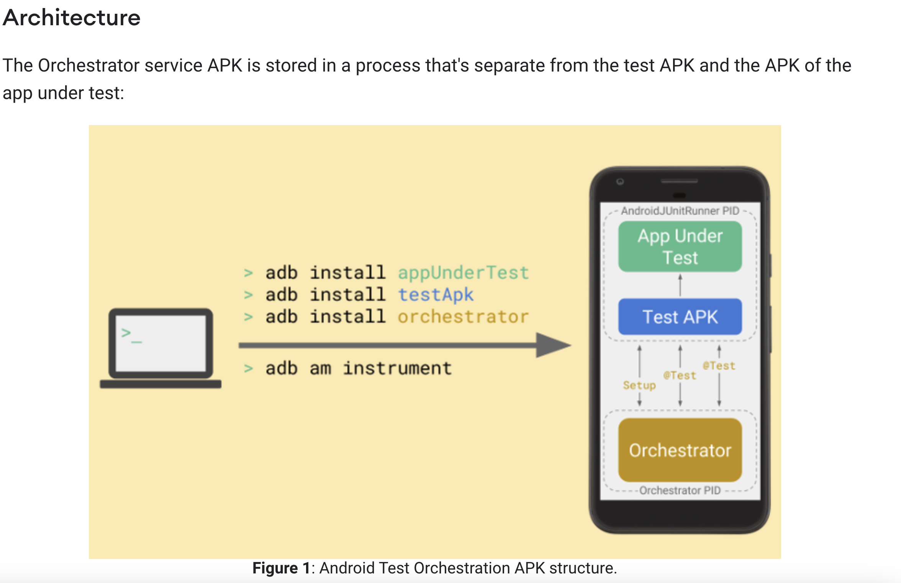

https://www.youtube.com/watch?v=EkfVL5vCDmo&list=PLQkwcJG4YTCSYJ13G4kVIJ10X5zisB2Lq

The Orchestrator service APK is stored in a process that's separate from the test APK and the APK of the app under test

**The AndroidJUnitRunner class is a JUnit test runner that lets you run instrumented JUnit 4 tests on Android devices, including those using the Espresso, UI Automator, and Compose testing frameworks.**. AndroidJUnitRunner is a Instrumentation that runs JUnit3 and JUnit4 tests against an Android package (application).

MonitoringInstrumentation - An instrumentation that enables several advanced features and makes some hard guarantees about the state of the application under instrumentation.

The test runner handles loading your test package and the app under test to a device, running your tests, and reporting test results.

`androidx/test/runner/AndroidJUnit4` -This class is deprecated. use `androidx.test.ext.junit.runners.AndroidJUnit4` instead.

