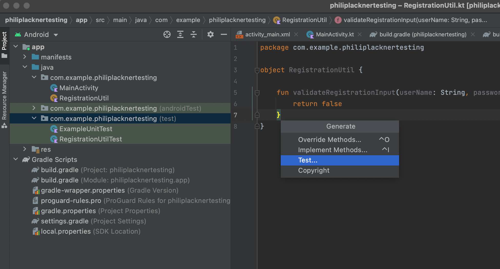

A unit test verifies the behavior of a small section of code, the unit under test. It does so by executing that code and checking the result.

## Dependencies needed

the dependency configuration used is `testImplementation` for unit tests

Main dependencies needed:
```groovy
dependencies {
  // Required -- JUnit 4 framework
  testImplementation "junit:junit:$jUnitVersion"
  // Optional -- Robolectric environment
  testImplementation "androidx.test:core:$androidXTestVersion"
  // Optional -- Mockito framework
  testImplementation "org.mockito:mockito-core:$mockitoVersion"
  // Optional -- mockito-kotlin
  testImplementation "org.mockito.kotlin:mockito-kotlin:$mockitoKotlinVersion"
  // Optional -- Mockk framework
  testImplementation "io.mockk:mockk:$mockkVersion"
}
```

## tests location

`src/test/java/`

## Quck way to generate tests in intellij/android studio



## Using more readable test names with kotlin

In kotlin you can do this:
```kotlin
  @Test
  fun `empty username returns false`(){
      
  }
```

## @Before and @After

`@Before` for setup and `@After` for teardown.

## Test runner and its configuration

No test runner configuration is needed by default, 

if you want to change a test runner you can specify it in `@RunWith(SOmeRunner.class)`.
Test runner in case of Mockito is `MockitoJUnitRunner`,
For e.g. you want to use RoboElectric framework, you would use `@RunWith(RobolectricTestRunner.class)`.

An example :
```java
@RunWith(RobolectricTestRunner.class)
public class MyActivityTest {

  @Test
  public void clickingButton_shouldChangeMessage() {
    MyActivity activity = Robolectric.setupActivity(MyActivity.class);
    activity.button.performClick();
    assertThat(activity.message.getText()).isEqualTo("Robolectric Rocks!");
  }
}
```

## Where does assert come from?

```kotlin
import org.junit.Assert.*
```

## Where does @Test come from?

```kotlin
import org.junit.Test
```

## Creating and running tests

## Mocking android framework

https://developer.android.com/training/testing/local-tests#mocking-dependencies

