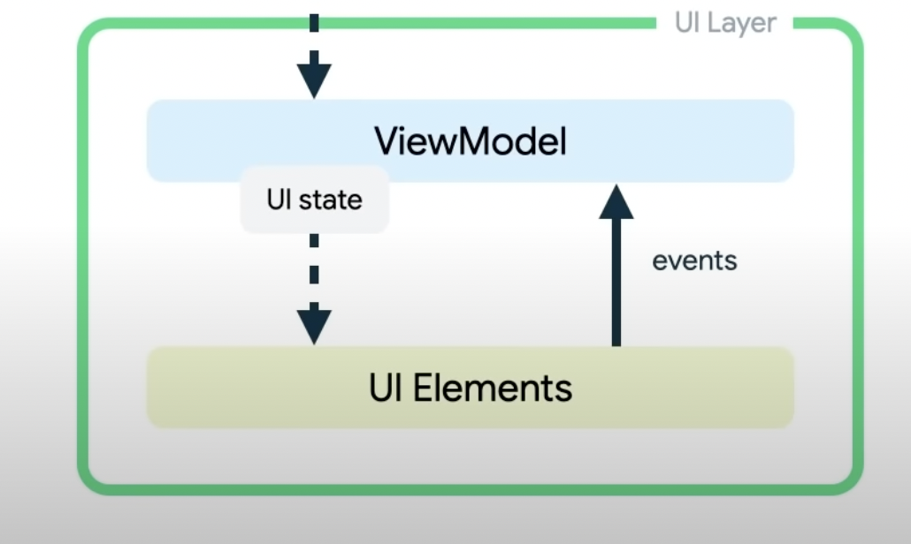

## UI Elements

BY UI Elements, we mean `View` and `Fragment`.

## UI Layer has UI data (held by **ViewModels**)

`UI data` is a subset of `App data`(which might have a lot more data), this subset `UI data` only holds
data shown to the end user via UI.

## UI element hierarchy as a function of UI data

UI elements should read UI data to decide what to render.
UI Elements always have access to UI data/state via ViewModels.

## UIState i.e. UI Data exposed from Viewmodels as observables

UI elements reflect immediately any changes done to UI state/data, by running observable callbacks and running changes/mutations 
on UI elements.

**Viewmodels are UI state/data holders, exposing UI state/data as observables**

## UiState as a plain data class

```kt
data class NewsUiState(
    val isSignedIn: Boolean = false,
    val isPremium: Boolean = false,
    val newsItems: List<NewsItemUiState> = listOf()
)
```


## Exposing of UIState as a observable stateflow (not mutable from outside, but mutable from inside)

`Note`: Read more about `Flow`,`StateFlow`, `Observable` and `LiveData`.

```kt
class NewsViewModel(
    private val repository: NewsRepository,
    ...
) : ViewModel() {
    private val _uiState = MutableStateFlow(NewsUiState())
    // non-private members are public by default
    val uiState: StateFlow<NewsUiState> = _uiState.asStateFlow() // exposed to views

    fun fetchArticles() {
        // mutate _uiState
    }
}
```

## Diagram



