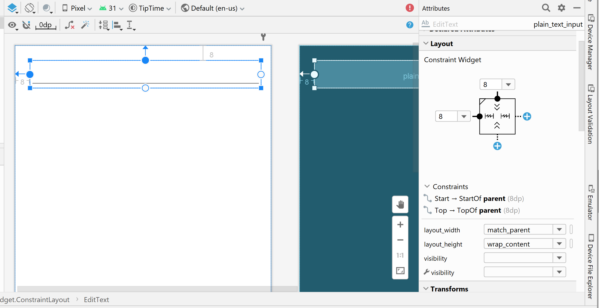

Full details: https://developer.android.com/training/constraint-layout

Allows to create large and complex layouts with a flat view hierarchy (no nested view groups).

Similar to `RelativeLayout` in that all views are `laid out according to relationships to sibling views and parent layout`, more flexible andusable with studio layout editor

## How to use

```groovy
dependencies {
    implementation "androidx.constraintlayout:constraintlayout:2.1.3"
    // To use constraintlayout in compose
    implementation "androidx.constraintlayout:constraintlayout-compose:1.0.0"
}
```

## Overview

1. add atleast one horizontal and one vertical constraint.

2. Each conection represents alignment to sibling, parent or invisible guideline.

3. if a view has no constraints when you run your layout on a device, it is drawn at position [0,0] (the top-left corner).

4. You cannot use `match_parent` for any view in a ConstraintLayout. Instead use **0dp**, which means **match constraints**. you can't set match_parent on UI elements in a ConstraintLayout. Instead, you need to constrain the start and end edges of the view, and set the width to 0dp. Setting the width to 0dp tells the system not to calculate the width, just try to match the constraints that are on the view.

## Studio usage



## Two constraints in same axis but opposing direction

If you add opposing constraints on a view, the constraint lines become squiggly like a spring to indicate the opposing forces.

The effect is most visible when the view size is set to "fixed" or "wrap content," in which case the view is centered between the constraints. If you instead want the view to stretch its size to meet the constraints, switch the size to "match constraints"; or if you want to keep the current size but move the view so that it is not centered, adjust the constraint bias.

## Parent position

constrain a side of a view to corresponding edge of layout (parent borders)

## Order position

Define order of appearance for two views, either vertically or horizontally,
Note that it does not imply alignment, so B can be right of A, but it can move up or down.

## Alignment

Align edge of view to same edge of another view.

