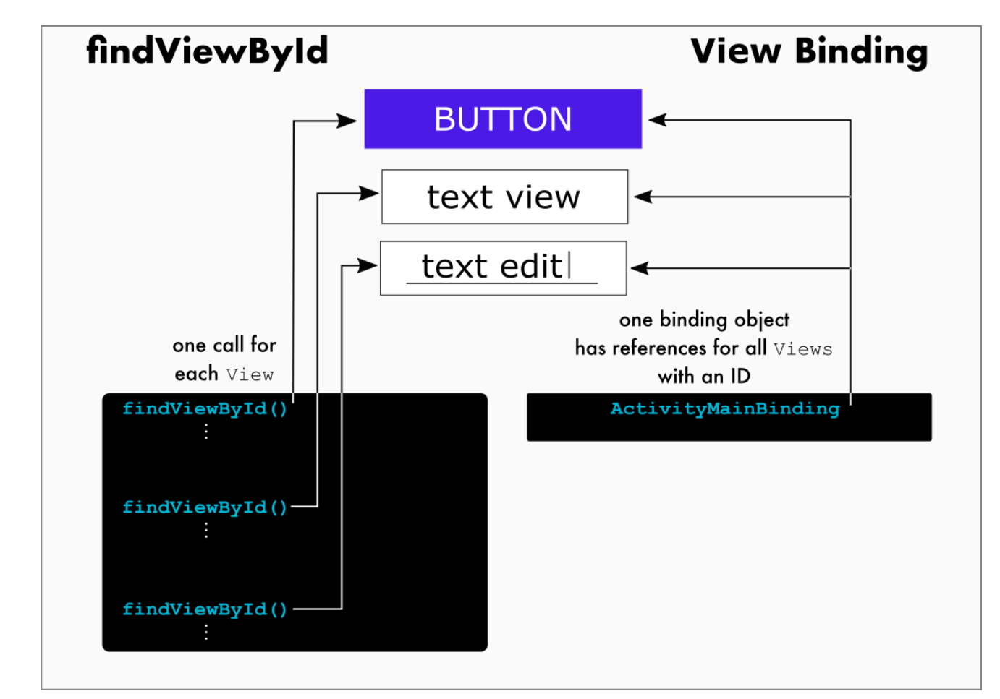

## Why?

Used to prevent `findViewById` boilerplate.

Details at: https://developer.android.com/topic/libraries/view-binding

## How to enable

```groovy
// app module build.gradle 
android {
    buildFeatures {
        viewBinding = true
    }
}
```

## Comparision with findViewById



## Code for using View binding

The name of the binding class is generated by converting the name of the XML file to Pascal case and adding the word "Binding" to the end. e.g. `activity_main.xml` -> `ActivityMainBinding`

in Pascal case `activity_main.xml` becomes `ActivityMainBinding`, and you can access `@id/text_view` as `binding.textView`.

```kotlin
class MainActivity : AppCompatActivity() {
    lateinit var binding: ActivityMainBinding /*The name of the binding class is generated by converting the name of the XML file to Pascal case and adding the word "Binding" to the end */

    override fun onCreate(savedInstanceState: Bundle?) {
        super.onCreate(savedInstanceState)
        binding = ActivityMainBinding.inflate(layoutInflater) // call static inflate method on ActivityMainBinding class to get actual binding instance

        setContentView(binding.root) // binding.root holds the view hierarchy, set it
    
        // usage of inner ids, from the binding, notice the camel casing of ids
        binding.myButton.text
    }
}
```

## Converting text to other types

```kotlin
    val costOfService: Double = binding.costOfService.text.toString().toDouble()
```