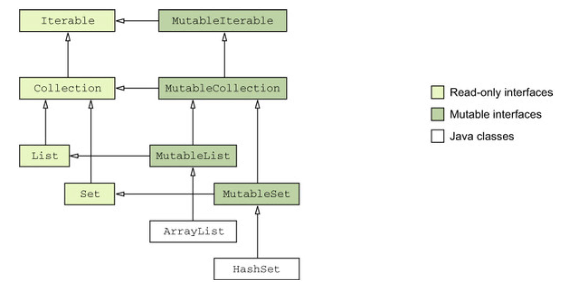

## Working with arrays

**Arrays in Kotlin are mutable by default, Lists in Kotlin are immutable by defaut**

In Kotlin, you can work with arrays of integers using the `IntArray` class. Here are some basic examples to help you get started:

### Creating an IntArray

1. **Using the `IntArray` constructor:**
   ```kotlin
   val arr = IntArray(5) // creates an IntArray of size 5 initialized with zeros
   ```

2. **Using the `intArrayOf` function:**
   ```kotlin
   val arr = intArrayOf(1, 2, 3, 4, 5) // creates an IntArray with specified elements
   ```

3. **Using the `Array` constructor with a lambda:**
   ```kotlin
   val arr = IntArray(5) { it * 2 } // creates an IntArray of size 5 with elements [0, 2, 4, 6, 8]
   ```

### Accessing and Modifying Elements

1. **Accessing elements:**
   ```kotlin
   val arr = intArrayOf(1, 2, 3, 4, 5)
   println(arr[0]) // prints 1
   println(arr[2]) // prints 3
   ```

2. **Modifying elements:**
   ```kotlin
   val arr = intArrayOf(1, 2, 3, 4, 5)
   arr[2] = 10
   println(arr[2]) // prints 10
   ```

### Iterating Over an IntArray

1. **Using a for loop:**
   ```kotlin
   val arr = intArrayOf(1, 2, 3, 4, 5)
   for (i in arr) {
       println(i)
   }
   ```

2. **Using the `forEach` function:**
   ```kotlin
   val arr = intArrayOf(1, 2, 3, 4, 5)
   arr.forEach { println(it) }
   ```

### Common Operations

1. **Finding the size of the array:**
   ```kotlin
   val arr = intArrayOf(1, 2, 3, 4, 5)
   println(arr.size) // prints 5
   ```

2. **Filtering elements:**
   ```kotlin
   val arr = intArrayOf(1, 2, 3, 4, 5)
   val filtered = arr.filter { it > 2 } // filter and other utility methods available over array as well
   println(filtered) // prints [3, 4, 5]
   ```

3. **Mapping elements:**
   ```kotlin
   val arr = intArrayOf(1, 2, 3, 4, 5)
   val mapped = arr.map { it * 2 }
   println(mapped) // prints [2, 4, 6, 8, 10]
   ```

4. **Summing elements:**
   ```kotlin
   val arr = intArrayOf(1, 2, 3, 4, 5)
   val sum = arr.sum()
   println(sum) // prints 15
   ```

### Examples

1. **Example: Sum of even numbers in an array:**
   ```kotlin
   val arr = intArrayOf(1, 2, 3, 4, 5, 6)
   val sumOfEvens = arr.filter { it % 2 == 0 }.sum()
   println(sumOfEvens) // prints 12
   ```

2. **Example: Reversing an array:**
   ```kotlin
   val arr = intArrayOf(1, 2, 3, 4, 5)
   val reversed = arr.reversedArray()
   println(reversed.joinToString()) // prints 5, 4, 3, 2, 1
   ```

These examples should give you a good starting point for working with `IntArray` in Kotlin. You can explore more functions and methods available for `IntArray` in the Kotlin standard library documentation.

## Working with 2D arrays

Create 2D arrays, with `val array2D = Array(rows) { IntArray(cols) }`

```kt
fun main() {
    // Declare a 2D array
    val rows = 3
    val cols = 4
    val array2D = Array(rows) { IntArray(cols) }

    // Initialize values in the 2D array
    array2D[0][0] = 1
    array2D[0][1] = 2
    array2D[1][2] = 3
    // ...

    // Accessing values in the 2D array
    val value = array2D[1][2]
    println("Value at (1, 2) is $value")

    // Iterating over the 2D array
    for (row in array2D) {
        for (element in row) {
            print("$element ")
        }
        println()
    }

    // Modifying values in the 2D array
    array2D[2][3] = 5

    // Getting the dimensions of the 2D array
    val numRows = array2D.size
    val numCols = array2D[0].size
    println("Number of rows: $numRows, Number of columns: $numCols")
}
```

## Collection interface

```kt
interface Collection {
    fun iterator()
    size
    fun contains()
}
```

These interfaces are for compile time/static type use checking, it may be pointing to a mutable collection underneath.

### Mutable collection interface

```kt
interface MutableCollection: Collection {
    fun add()
    fun remove()
    fun clear()
}
```

### Things to think about

1. is collection nullable? e.g. `List<String>?`
2. Are collection elements nullable? e.g. `List<String?>`
3. Will the collection be modified? e.g. `MutableList<String>` or `MutableList<String?>`

### Kotlin collection hierarchy



Kotlin sees `java.util.ArrayList` and `java.util.HashSet` as instances of `MutbaleList` and `MutaleSet` respectively.

## Java Interop

Java does not distinguish between read only and mutable collections. and it can modify readonly collections passed from Kotlin side.

## Sequence

https://kotlinlang.org/api/latest/jvm/stdlib/kotlin.sequences/-sequence/

A sequence that returns values through its iterator. The values are evaluated lazily, and the sequence is potentially infinite.

Sequences can be iterated multiple times, however some sequence implementations might constrain themselves to be iterated only once. That is mentioned specifically in their documentation (e.g. generateSequence overload). The latter sequences throw an exception on an attempt to iterate them the second time.

## Grouping

https://kotlinlang.org/api/latest/jvm/stdlib/kotlin.collections/-grouping/

Represents a source of elements with a `keyOf` function, which can be applied to each element to get its key.

A `Grouping` structure serves as an intermediate step in `group-and-fold` operations: they group elements by their keys and then fold each group with some aggregating operation.

It is created by attaching `keySelector: (T) -> K` function to a source of elements. To get an instance of Grouping use one of **groupingBy extension functions**

- Iterable.groupingBy
- Sequence.groupingBy
- Array.groupingBy
- CharSequence.groupingBy

Extension functions: https://kotlinlang.org/api/latest/jvm/stdlib/kotlin.collections/-grouping/#extension-functions

## For loop is inclusive of end index

```kt
for (i in 0..5) {
        println(i) // 0,1,2,3,4,5   --> upto 5
}
```

## Iterating an array with index

```kt
for ((index, value) in array.withIndex()) {
}
```

## Sort by indexing into another array

```kt
/**
    Input: names = ["Mary","John","Emma"], heights = [180,165,170]
    Output: ["Mary","Emma","John"]
    Explanation: Mary is the tallest, followed by Emma and John.
*/
fun sortPeople(names: Array<String>, heights: IntArray): Unit {
    val sortedArray = names.withIndex().sortedBy {
        heights[it.index]
    }
    val ans = sortedArray.map { it.value }
}
```

## Sort a collection in place using a comparator via `sortWith`

```kt
val list = listOf(7,3,5,9,1,3)
list.sortedWith(Comparator<Int>{ a, b ->
    when {
        a > b -> 1
        a < b -> -1
        else -> 0
    }
})
```

**Note** - `sortWith` is a **mutable** operation, i.e. it modifies the collection in place.
`sortedWith` is the immutable version of `sortWith` which returns a new collection.

## Counting down

```kt
// 100 downTo 0
for (i in 100 toward 0) {
    // Do things
}
```

## Creating normal array with size

```kt
var arr = IntArray(size) // construct with only size
```

## Creating 2d array in Kotlin

```kt
var matrix: Array<IntArray> = Array(height) { IntArray(width) }

// from an existing grid
var ansArray = Array(grid.length) { IntArray(grid[0].length) }
```

## IntArray has `.size` and not `.length`


## Ranges using `a..b` and complemented by `in` operator for containment checking

**Ranges can be used for any data type that is Comparable**

**Ranges are not iterable by defualt, iterable needs to be explicitly implemented on type separately for type to be used with for-in on a type with range** - https://kotlinlang.org/docs/ranges.html#progression

`..` is an operator function with name `rangeTo(that)` which is **called on the start instance**, and given the value of `end`.

`Range<T>` requires `<T : Comparable>`, i.e. it needs parameters to be comparable.

`rangeTo()` is complemented by `in` or `!in` functions, to check containment, which invokes `.contains()` method on range object.

**Note** - `Range` can be created from **any Comparable** via `C1..C2`, e.g. proof:

```kt
public operator fun <T : Comparable<T>> T.rangeTo(that: T): ClosedRange<T> = ComparableRange(this, that)
// rangeTo is invoked via `C1..C2`
```

e.g. Making `MyDate` comparable will allow us to use `..` and `in` operator on `MyDate` automatically.

```kt
data class MyDate(val year: Int, val month: Int, val dayOfMonth: Int) : Comparable<MyDate> {
    override fun compareTo(other: MyDate): Int {
        if (year != other.year) return year - other.year
        if (month != other.month) return month - other.month
        return dayOfMonth - other.dayOfMonth
    }
}
```

```kt
operator fun <T : Comparable<T>> T.rangeTo(
    that: T
): ClosedRange<T>
```

## Progression is same as Iterable

To iterate over a range, it needs to implement Progression interface

```
open class IntProgression : Iterable<Int>
```

## Useful extensions

### Convert List to Set

`list.toSet()`

### Convert Set to List

`set.toList()`

## Read only collection interface type isn't necessary immutable

If you’re working with a variable that has a read-only interface type e.g. `List`, this can be just one of the many references to the same mutable collection `MutableList`.

## iterators can be defined as extension on a type

e.g. string was made iterable by defining `iterator()` extension function on `CharSequence` type.

```kt
operator fun CharSequence.iterator(): CharIterator

// usage
for(s in "afaf") {...}
```

## Many collection functions are inlined!

e.g. Iterable.forEach

```kt
public inline fun <T> Iterable<T>.forEach(action: (T) -> Unit): Unit {
    for (element in this) action(element)
}
```

## How to use stacks in Kotlin

`ArrayDeque` is a multi utility class that is useful for stack:
Kotlin 1.3.70 introduced the kotlin.collections.ArrayDeque class, which functions as both a queue and a stack, like Java's java.util.Deque (Deque meaning "double-ended queue"). It was created out of a necessity for a multiplatform ArrayDeque implementation.

```kt
val stack = ArrayDeque(listOf(1, 2, 3)) // stack: [1, 2, 3]
stack.addLast(0)                        // stack: [1, 2, 3, 0]         (push)
val value = stack.removeLast()          // value: 0, stack: [1, 2, 3]  (pop)
```

### Tree set

Usag is similar to that of Java, you can init it with a set
```kt
    fun nthUglyNumber(n: Int): Int {
        if (n == 1) {
            return 1;
        }
        // sorting ordering is necessary for correctness!
        var lst = TreeSet(setOf(1L))
        for (i in 1..n-1) {
            // we poll n-1 ugly numbers
            var el = lst.pollFirst()
            // println("el = "+ el)
            lst.add(el*2)
            lst.add(el*3)
            lst.add(el*5)
        }
        // nth ugly number
        return lst.pollFirst().toInt()
    }
```