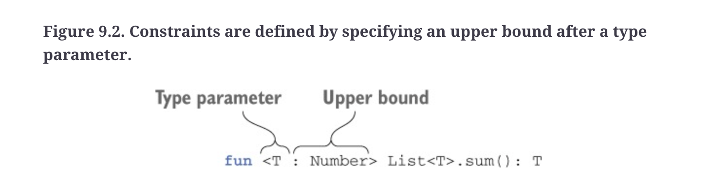

## Notation 

`T : A` or `T extends A` means `T is a subtype of A`. or `T <: A`.


Subtypes are substitutable for super types.

subtypes can override with stronger specs(but not more general specs).



all subclasses can be considered subtypes (but subtyping - usually via interfaces, is orthogonal to implementation inheritance - composition). subclassing gives us both implementation re-use and subtyping at the same time.

### Method subtyping rules

A method `A1->A2` is a subtype of method `B1->B2` if, `A1->A2` can be used anywhere `B1->B2` is used.

A subtype method would need to have a more loose/general input type, and much specific return type, so callers are not surprised in terms of sending arguments expectations and return value shape expectations.


## Specifying type constraints

In type parameter angle brackets, use the kotlin convention of `<T : X>` instead of `<T extends X>`

```kt
// only allow subtypes of number
fun <T : Number> 
```


## inline and re-ification

You can declare a function as `inline` so that its type arguments are not erased.
In kotlin terms this is known as `re-ification`.

## Arrays are invariant

Arrays in Kotlin are not built on native types, but are instead based on a Java array. Although these are similar, they do behave slightly differently. In Java, we can assign an array of a type to an array of its parent type. Arrays in Kotlin are invariant, which means that an array of a specific type cannot be assigned to an array of its parent type.


```kotlin
val listOfInts :Array<Int> = arrayOf(1,2) 
val listOfNums: Array<Number> = listOfInts // Compiler ERROR! incompatible types
```

## Lists are covariant


## in and out

`in` - contravariant, allowed in input types e.g. function parameters.
`out` - covariant, allowed in output types e.g. function return types.

In Kotlin, generics are by default invariant, meaning that no subtype relationship exists between different instantiations of the same generic type with different type arguments. However, Kotlin allows you to specify variance annotations on type parameters of generic types to allow for more flexible subtype relationships. The two key keywords for this are `out` (covariance) and `in` (contravariance).

### Covariance (`out`)

When a generic type parameter is marked with the `out` keyword, it is considered covariant. This means that if `B` is a subtype of `A`, then `Generic<B>` is considered a subtype of `Generic<A>`. The `out` keyword indicates that the type parameter is only used in "out" positions, meaning it can only be returned from functions and never consumed.

Here's an example:

```kotlin
open class Animal
class Cat : Animal()

class Box<out T> {
    fun get(): T { ... } // This is OK.
    // fun set(item: T) { ... } // Error: T is an 'out' parameter.
}

val catBox: Box<Cat> = Box<Cat>()
val animalBox: Box<Animal> = catBox // This is allowed due to covariance.
```

In this example, `Box<Cat>` can be assigned to a variable of type `Box<Animal>` because `Box` is covariant in `T`.

### Contravariance (`in`)

Contravariance is specified using the `in` keyword. If `B` is a subtype of `A`, then `Generic<A>` is a subtype of `Generic<B>`. The `in` keyword means that the type parameter is only used in "in" positions, where it is consumed and not returned from functions.

Here's an example:

```kotlin
open class Animal
class Cat : Animal()

class Cage<in T> {
    // fun get(): T { ... } // Error: T is an 'in' parameter.
    fun set(item: T) { ... } // This is OK.
}

val animalCage: Cage<Animal> = Cage<Animal>()
val catCage: Cage<Cat> = animalCage // This is allowed due to contravariance.
```

In this example, `Cage<Animal>` can be assigned to a variable of type `Cage<Cat>` because `Cage` is contravariant in `T`.

### Use-site Variance

Instead of declaring variance on the type parameter itself (declaration-site variance), Kotlin also allows specifying variance at the use-site, when you are working with instances. You can do this with the `out` and `in` projections:

```kotlin
fun takeCats(cats: List<out Cat>) { ... }
fun fillCageWithAnimals(cage: Cage<in Animal>) { ... }

val cats: List<Cat> = listOf(Cat(), Cat())
takeCats(cats) // This is allowed; List<Cat> is a subtype of List<out Cat>.

val catCage: Cage<Cat> = Cage<Cat>()
fillCageWithAnimals(catCage) // This is allowed; Cage<Animal> is a subtype of Cage<in Cat>.
```

Use-site variance is useful when you want to specify variance on a case-by-case basis without affecting the entire class's variance.

In summary, Kotlin's type system allows you to specify variance using `out` (covariant) and `in` (contravariant), either at the declaration site or at the use-site, giving you flexibility in how you design your APIs. This helps to ensure that you can maintain type safety while also making your code more reusable and interoperable.