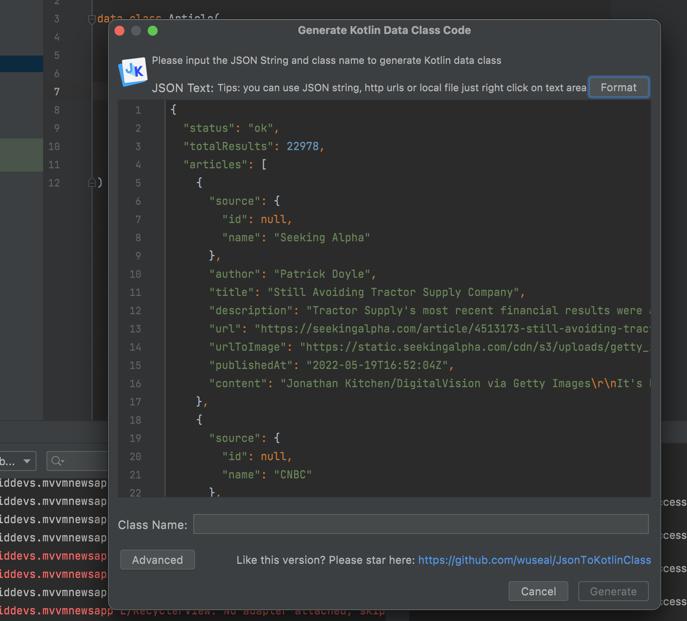

## Quick way to generate data classes from json response

Use json to kotlin class plugin





## Add kotlin interfaces for all remote API

recommended to create an api folder for this


## Coroutine integration

All the interface methods annoted with GET/POST must be made suspend fun i.e.
```kt
public interface MyApi {
    @GET("/v2/top-headlines")
    suspend fun getBreakingNews(){
        
    }
}
```

In the usage site
```kt
GlobalScope.launch(Dispatchers.IO) {
    val news = myapi.getBreakingNews()
    for (item in news) {
        println(item)
    }
}
```

In case you dont want to use suspend functions and returning a `Call` object, then you can call `.await()` on the return value

## Setting up retrofit instance lazily in a singleton

we get api instance from retrofit instance by providing api class:
e.g.
`val newsApi = retrofitInstance.create(NewsAPI::class.java)`

```kt
package com.androiddevs.mvvmnewsapp.api

import com.androiddevs.mvvmnewsapp.util.Constants.Companion.BASE_URL
import okhttp3.OkHttpClient
import okhttp3.logging.HttpLoggingInterceptor
import retrofit2.Retrofit
import retrofit2.converter.gson.GsonConverterFactory

class RetroFitInstance {
    companion object {
        private val retrofit by lazy {
            val loggingInterceptor = HttpLoggingInterceptor()
            loggingInterceptor.setLevel(HttpLoggingInterceptor.Level.BODY)

            // we create okhttp client with custom interceptor
            val client = OkHttpClient.Builder()
                .addInterceptor(loggingInterceptor)
                .build()

            // setup retrofit instance with baseurl, okhttpclient and serialize/desieralize settings
            Retrofit.Builder()
                .baseUrl(BASE_URL)
                .addConverterFactory(GsonConverterFactory.create())
                .client(client)
                .build()
        }

        val api by lazy {
            // we get api instance from retrofit instance by providing api class
            retrofit.create(NewsAPI::class.java)
        }
    }
}
```